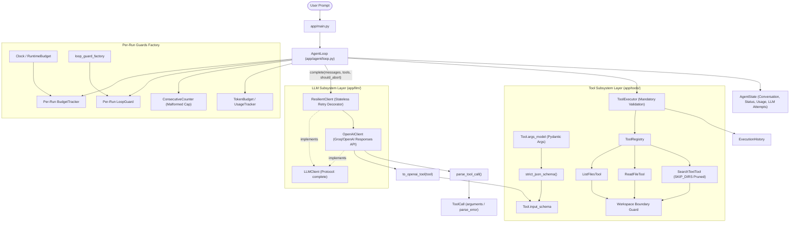

# Agent Runtime Codebase Architecture & In-Depth Technical Documentation

ဤ Documentation သည် **Agent Runtime** codebase တစ်ခုလုံးရှိ folder နှင့် file တစ်ခုချင်းစီ၏ Source Code အပြည့်အစုံ၊ Function/Class တစ်ခုချင်းစီ၏ အသေးစိတ်အလုပ်လုပ်ပုံ၊ Design Decisions များနှင့် လက်တွေ့ အသုံးပြုပုံ (Usage) တို့ကို စနစ်တကျ ရှင်းပြထားသော Technical Reference ဖြစ်ပါသည်။

---

## မာတိကာ (Table of Contents)

1. [High-Level Architecture & Lifecycle](#1-high-level-architecture--lifecycle)
2. [Runtime Guard Order & Safety Pipeline](#2-runtime-guard-order--safety-pipeline)
3. [Root & Entry Point Layer](#3-root--entry-point-layer)
   - [`app/main.py`](#appmainpy)
   - [`conftest.py`](#conftestpy)
4. [LLM Subsystem Layer (`app/llm/`)](#4-llm-subsystem-layer-appllm)
   - [`app/llm/types.py`](#appllmtypespy)
   - [`app/llm/errors.py`](#appllmerrorspy)
   - [`app/llm/retry.py`](#appllmretrypy)
   - [`app/llm/llm_errors.py`](#appllmllm_errorspy)
   - [`app/llm/client.py`](#appllmclientpy)
   - [`app/llm/openai_client.py`](#appllmopenai_clientpy)
   - [`app/llm/fake_client.py`](#appllmfake_clientpy)
   - [`app/llm/resilient_client.py`](#appllmresilient_clientpy)
   - [`app/llm/openai_tools.py`](#appllmopenai_toolspy)
   - [`app/llm/__init__.py`](#appllm__init__py)
5. [Tools & Sandbox Execution Layer (`app/tools/`)](#5-tools--sandbox-execution-layer-apptools)
   - [`app/tools/base.py`](#apptoolsbasepy)
   - [`app/tools/call.py`](#apptoolscallpy)
   - [`app/tools/call_parsing.py`](#apptoolscall_parsingpy)
   - [`app/tools/execution.py`](#apptoolsexecutionpy)
   - [`app/tools/workspace.py`](#apptoolsworkspacepy)
   - [`app/tools/schemas.py`](#apptoolsschemaspy)
   - [`app/tools/schema_utils.py`](#apptoolsschema_utilspy)
   - [`app/tools/validation.py`](#apptoolsvalidationpy)
   - [`app/tools/registry.py`](#apptoolsregistrypy)
   - [`app/tools/executor.py`](#apptoolsexecutorpy)
   - [`app/tools/list_files.py`](#apptoolslist_filespy)
   - [`app/tools/read_file.py`](#apptoolsread_filepy)
   - [`app/tools/search_text.py`](#apptoolssearch_textpy)
   - [`app/tools/__init__.py`](#apptools__init__py)
6. [Agent Runtime & Control Layer (`app/agent/`)](#6-agent-runtime--control-layer-appagent)
   - [`app/agent/clock.py`](#appagentclockpy)
   - [`app/agent/budget.py`](#appagentbudgetpy)
   - [`app/agent/cost.py`](#appagentcostpy)
   - [`app/agent/history.py`](#appagenthistorypy)
   - [`app/agent/loop_guard.py`](#appagentloop_guardpy)
   - [`app/agent/state.py`](#appagentstatepy)
   - [`app/agent/loop.py`](#appagentlooppy)
   - [`app/agent/__init__.py`](#appagent__init__py)
   - [Historical Note: Structured Output Explorations (`experiments/`)](#historical-note-structured-output-explorations-experiments)
7. [Test Suite Architecture & Quality Assurance (`tests/`)](#7-test-suite-architecture--quality-assurance-tests)
   - [`tests/builders.py`](#testsbuilderspy)
   - [Test Suite Categories & Coverage](#test-suite-categories--coverage)
   - [Quality Automation & Tooling](#quality-automation--tooling)
8. [Core Design Principles & Takeaways](#8-core-design-principles--takeaways)

---

## 1. High-Level Architecture & Lifecycle

Agent Runtime သည် **LangChain, LangGraph, CrewAI, LlamaIndex** ကဲ့သို့သော ပြင်ပ framework များကို လုံးဝမသုံးဘဲ Python 3.12 native standard libraries နှင့် Official OpenAI SDK ကိုသာ အသုံးပြုကာ သန့်ရှင်းကျစ်လျစ်စွာ တည်ဆောက်ထားသော autonomous software engineering agent ဖြစ်ပါသည်။

### Architectural Layering Rules:
Codebase သည် အောက်ပါ strict dependency flow အတိုင်း စီးဆင်းပြီး unit tests (`tests/test_layering.py`) ဖြင့် ကာကွယ်ထားပါသည်:
- **`app/agent` -> `app/llm` -> `app/tools`**
- **Rule 1**: `app/agent` သည် provider SDK (`openai`) ကို import မလုပ်ရ။
- **Rule 2**: `app/llm` သည် `app/agent` ကို import မလုပ်ရ။
- **Rule 3**: `app/tools` သည် `app/agent` သို့မဟုတ် `app/llm` ကို import မလုပ်ရ။
- Conversation history သည် provider-neutral plain dict list ဖြစ်ပြီး provider format ပြောင်းလဲခြင်းများကို `app/llm/openai_client.py` အတွင်း၌သာ သီးသန့် ပြုလုပ်သည်။

### System Flowchart



---

## 2. Runtime Guard Order & Safety Pipeline

`AgentLoop.run()` ထဲတွင် iteration တိုင်းသည် အောက်ပါ guard order အတိုင်း အဆင့်ဆင့် တိကျစွာ လည်ပတ်ပါသည်:

1. **Wall-clock Budget Check**: စုစုပေါင်း ကြာချိန်သတ်မှတ်ချက် ကျော်မကျော် စစ်ဆေးခြင်း (`TIMEOUT`).
2. **Iteration Budget Check**: အမြင့်ဆုံး iteration သတ်မှတ်ချက် ကျော်မကျော် စစ်ဆေးခြင်း (`MAX_ITERATIONS`).
3. **LLM Call Execution**: `client.complete(messages, tools, should_abort)` ဖြင့် provider-neutral messages များကို ပေးပို့ခေါ်ယူခြင်း။
   - Stateless retry loop ဖြင့် transient error များကို exponential backoff ဖြင့် retry လုပ်သည်။
   - Deadline ကျော်လွန်ပါက `DeadlineExceeded` ထွက်ပေါ်ပြီး `TIMEOUT` သတ်မှတ်သည်။
   - Retries ကုန်ဆုံးပါက သို့မဟုတ် permanent error ဖြစ်ပါက `LLMCallFailed` ထွက်ပေါ်ပြီး `LLM_FAILED` သတ်မှတ်သည်။
   - Exception တက်ချိန်၌လည်း `attempt_log` ကို `state.llm_attempts` ထဲသို့ မပျောက်ပျက်အောင် သိမ်းဆည်းသည်။
4. **Usage Recording**: `response.usage` ကို `UsageTracker` တွင် မှတ်တမ်းတင်ပြီး response attempt များကို `state.llm_attempts` သို့ ထည့်သွင်းခြင်း။
5. **Final Answer Verification**: Model က Tool မခေါ်ဘဲ အဖြေတိုက်ရိုက်ပေးလျှင် `COMPLETED` အဖြစ် ချက်ချင်းလက်ခံခြင်း (Token budget ကျော်လွန်နေသော်လည်း ပြီးစီးသွားသောအဖြေကို လက်ခံသည်)။
6. **Token Budget Check**: Tool side-effects များကို မလုပ်ဆောင်မီ Token budget ကျော်မကျော် စစ်ဆေးခြင်း (`TOKEN_BUDGET_EXCEEDED`).
7. **Per-Tool-Call Safety & Execution**:
   - **Malformed Argument / Parse Error Check**: Model ထံမှ arguments များသည် JSONDecodeError ဖြစ်နေပါက သို့မဟုတ် dict မဟုတ်ပါက runtime crash မဖြစ်စေဘဲ parse error ကို observation အဖြစ် model ထံ ပြန်ပို့ပေးပြီး `ConsecutiveCounter` ဖြင့် မှတ်သားသည်။ ဆက်တိုက် ၃ ကြိမ် မမှန်ကန်ပါက `LOOP_DETECTED` ဖြင့် loop ရပ်တန့်သည်။
   - **Loop Guard Check**: Tool arguments fingerprint ကိုစစ်ပြီး တူညီသော Tool Call ထပ်ခါထပ်ခါ ခေါ်နေခြင်းကို ကာကွယ်ခြင်း (`LOOP_DETECTED`).
   - **Mandatory Tool Validation & Execution**: `ToolExecutor` ဖြင့် `tool.args_model` မှတစ်ဆင့် validation စစ်ဆေးပြီး workspace boundary အတွင်း tool ကို execute လုပ်ခြင်း။ ရလဒ် သို့မဟုတ် observation ကို `tool_result_message` အဖြစ် conversation history ထဲသို့ ထည့်သွင်းခြင်း။

---

## 3. Root & Entry Point Layer

### `app/main.py`
အက်ပလီကေးရှင်း စတင် run သော Bootstrapping file ဖြစ်ပါသည်။ Component အားလုံးကို instantiate လုပ်ပြီး Dependency Injection ဖြင့် ချိတ်ဆက် run ပေးပါသည်။

#### Source Code:
```python
import json
import os
from pathlib import Path

from dotenv import load_dotenv

from app.agent import (
    AgentLoop,
    LoopGuard,
    ModelPricing,
    RuntimeBudget,
    TokenBudget,
)
from app.llm import OpenAIClient, ResilientClient, RetryPolicy
from app.tools import (
    ListFilesTool,
    ReadFileTool,
    SearchTextTool,
    ToolExecutor,
    ToolRegistry,
    Workspace,
)


def build_registry(workspace: Workspace) -> ToolRegistry:
    registry = ToolRegistry()
    registry.register(ListFilesTool(workspace))
    registry.register(ReadFileTool(workspace))
    registry.register(SearchTextTool(workspace))
    return registry


def pricing_from_env() -> ModelPricing | None:
    raw_in = os.getenv("MODEL_INPUT_USD_PER_MTOK")
    raw_out = os.getenv("MODEL_OUTPUT_USD_PER_MTOK")
    if not raw_in or not raw_out:
        return None
    return ModelPricing(float(raw_in), float(raw_out))


def main() -> None:
    load_dotenv()

    workspace = Workspace(Path.cwd())
    registry = build_registry(workspace)
    executor = ToolExecutor(registry)

    runtime_budget = RuntimeBudget(
        max_wall_time_seconds=120.0,
        per_call_timeout_seconds=30.0,
    )

    inner = OpenAIClient(
        system_prompt=(
            "You are a software engineering agent. "
            "You must ONLY call the tools explicitly provided: list_files, read_file, search_text. "
            "Never use any namespace prefixes or tools not defined (such as repo_browser). "
            "Only use workspace-relative paths. "
            "Do not invent file contents."
        ),
        timeout_seconds=runtime_budget.per_call_timeout_seconds,
    )

    client = ResilientClient(
        inner,
        RetryPolicy(
            max_attempts=5,
            base_delay_seconds=3.0,
            max_delay_seconds=25.0,
        ),
    )

    agent = AgentLoop(
        client=client,
        registry=registry,
        executor=executor,
        max_iterations=10,
        runtime_budget=runtime_budget,
        loop_guard_factory=lambda: LoopGuard(block_on_nth_call=3),
        token_budget=TokenBudget(
            max_total_tokens=int(os.getenv("AGENT_MAX_TOTAL_TOKENS", "50000"))
        ),
        pricing=pricing_from_env(),
    )

    state = agent.run(
        "Explain the app directory and identify the main agent loop file."
    )

    print("\n=== Final Response ===\n")
    print(state.final_response)

    print(f"\n=== Status: {state.status.value} ===")
    if state.error:
        print(state.error)

    if state.llm_attempts:
        print("\n=== LLM Retry Log ===\n")
        for rec in state.llm_attempts:
            print(rec)

    print("\n=== Usage Report ===\n")
    print(json.dumps(state.usage.report(), indent=2))

    print("\n=== Execution History ===\n")
    print(state.history.to_json())


if __name__ == "__main__":
    main()
```

#### အသေးစိတ် ရှင်းလင်းချက်:
- `build_registry(workspace)`: ပေးလိုက်သော `Workspace` အပေါ်အခြေခံ၍ `ListFilesTool`, `ReadFileTool`, `SearchTextTool` ၃ ခုကို ဖန်တီးကာ `ToolRegistry` ထဲသို့ မှတ်ပုံတင်ပေးသည်။
- `pricing_from_env()`: Environment variable များဖြစ်သော `MODEL_INPUT_USD_PER_MTOK` နှင့် `MODEL_OUTPUT_USD_PER_MTOK` တို့မှတစ်ဆင့် token ၁ သန်းလျှင် ကုန်ကျမည့် ဒေါ်လာနှုန်းထားကိုဖတ်ပြီး `ModelPricing` object ပြန်ပေးသည်။ သတ်မှတ်မထားပါက `None` ပြန်ပေးသည်။
- `main()`:
  1. `load_dotenv()` ဖြင့် `.env` ဖိုင်မှ environment variables များကို load လုပ်သည်။
  2. လက်ရှိ directory (`Path.cwd()`) ဖြင့် `Workspace` sandbox boundary ကို သတ်မှတ်သည်။
  3. `ToolRegistry` ကို `ToolExecutor(registry)` ထဲသို့ ထည့်သွင်းသည် (validation သည် tool တစ်ခုချင်းစီ၏ `args_model` မှတစ်ဆင့် mandatory အလိုအလျောက် စစ်ဆေးသည်)။
  4. `RuntimeBudget` ဖြင့် wall-clock စက္ကန့် ၁၂၀၊ call တစ်ခုလျှင် ၃၀ စက္ကန့် သတ်မှတ်သည် (`max_iterations` ကို `AgentLoop` ကသာ single source of truth အဖြစ် သီးသန့် ကိုင်တွယ်သည်)။
  5. `OpenAIClient` ကို socket timeout ဖြင့် initialize လုပ်ပြီး `ResilientClient` ဖြင့် wrap လုပ်ကာ exponential backoff retry policy (အများဆုံး ၅ ကြိမ်အထိ၊ base delay 3.0s၊ max delay 25.0s) သတ်မှတ်သည်။ System prompt တွင်လည်း namespace prefix ပါသော မရှိသည့် tool များ (ဥပမာ `repo_browser.list_files`) ကို မခေါ်ဘဲ ပေးထားသော tools သာ အတိအကျ ခေါ်ရန် တင်းကျပ်စွာ ကန့်သတ်ထားသည်။
  6. `AgentLoop` ကို `max_iterations=10`၊ `runtime_budget` နှင့် `loop_guard_factory=lambda: LoopGuard(block_on_nth_call=3)` ပေးပို့ကာ initialize လုပ်သည်။
  7. ရရှိလာသော `AgentState` မှ Final Response, Status, `state.llm_attempts` မှ LLM Retry Log, Token Usage Report နှင့် Tool Execution History များကို Terminal တွင် print ထုတ်ပေးသည်။

---

### `conftest.py`
Pytest root configuration ဖိုင်ဖြစ်ပါသည်။

#### Source Code:
```python
# conftest.py — project-root conftest
# Placing this file here tells pytest to add the agent-runtime/ directory
# to sys.path so that `from app.xxx import ...` works in all test modules.
```

#### အသေးစိတ် ရှင်းလင်းချက်:
- ပရောဂျက် root တွင် ဤဖိုင်ကို ထားရှိခြင်းဖြင့် `pytest` run သည့်အခါ root folder ကို Python ၏ `sys.path` ထဲသို့ အလိုအလျောက် ထည့်သွင်းပေးပါသည်။ ထို့ကြောင့် `tests/` ဖိုင်များမှ `from app.xxx import ...` ဟု သန့်ရှင်းစွာ import ခေါ်ယူအသုံးပြုနိုင်စေပါသည်။

---

## 4. LLM Subsystem Layer (`app/llm/`)

LLM provider များနှင့် ချိတ်ဆက်လုပ်ဆောင်သော သီးသန့် subsystem layer ဖြစ်သည်။ Layering Rule အရ `app/llm` သည် `app/tools` သို့သာ import လုပ်ခွင့်ရှိပြီး `app/agent` ဆီသို့ လုံးဝ dependency မစီးဆင်းရပါ (provider SDK ဖြစ်သည့် `openai` ကို `app/llm` အတွင်း၌သာ သီးသန့် import လုပ်ခွင့်ရှိပြီး `app/agent` က တိုက်ရိုက် import မလုပ်ရပါ)။ မည်သည့် provider (OpenAI, Anthropic, Gemini, Groq, Ollama) ပြောင်းလဲသုံးစွဲသည်ဖြစ်စေ core runtime မထိခိုက်စေရန် provider-independent message schema (`user_message`, `assistant_message`, `tool_result_message`), generic `LLMResponse`, `Usage`, `LLMClient` Protocol နှင့် stateless `ResilientClient` decorator တို့ဖြင့် တည်ဆောက်ထားပါသည်။

### `app/llm/types.py`
Provider-independent data contracts များနှင့် message helper functions များ စုစည်းရာနေရာ ဖြစ်ပါသည်။

#### Source Code:
```python
from __future__ import annotations

from dataclasses import dataclass, field
from typing import Any

from app.tools import ToolCall

from .retry import ErrorKind


@dataclass(frozen=True)
class Usage:
    """Provider-independent token usage for one LLM call."""

    input_tokens: int = 0
    output_tokens: int = 0

    @property
    def total_tokens(self) -> int:
        return self.input_tokens + self.output_tokens

    def __add__(self, other: Usage) -> Usage:
        return Usage(
            input_tokens=self.input_tokens + other.input_tokens,
            output_tokens=self.output_tokens + other.output_tokens,
        )


def _first_int(obj: Any, *names: str) -> int | None:
    for name in names:
        value = getattr(obj, name, None)
        if isinstance(value, int) and not isinstance(value, bool):
            return value
    return None


def extract_usage(response: Any) -> Usage | None:
    """
    Normalise provider usage into Usage.

    Returns None (NOT zero) when the provider did not report usage.
    Silent zero would make budget enforcement fail open.

    Supports Responses-API naming (input_tokens/output_tokens) and
    Chat-Completions naming (prompt_tokens/completion_tokens).
    """
    raw = getattr(response, "usage", None)
    if raw is None:
        return None

    input_tokens = _first_int(raw, "input_tokens", "prompt_tokens")
    output_tokens = _first_int(raw, "output_tokens", "completion_tokens")

    if input_tokens is None or output_tokens is None:
        return None

    return Usage(input_tokens=input_tokens, output_tokens=output_tokens)


@dataclass(frozen=True)
class AttemptRecord:
    attempt: int
    error: str
    kind: ErrorKind
    delay_seconds: float


@dataclass(frozen=True)
class LLMResponse:
    """Provider-independent result of one LLM call.

    assistant_items are opaque, JSON-serializable provider items
    (message / function_call / reasoning ...) that the same provider
    must be given back on the next call. The loop stores them but
    never inspects them.
    """

    text: str
    tool_calls: tuple[ToolCall, ...]
    usage: Usage | None
    assistant_items: tuple[dict[str, Any], ...] = field(default_factory=tuple)
    attempts: tuple[AttemptRecord, ...] = field(default_factory=tuple)


# --- provider-neutral conversation messages -------------------------------
# Each message is a plain JSON-serializable dict with a "kind" key:
#   {"kind": "user", "text": str}
#   {"kind": "assistant", "items": [dict, ...]}      (opaque provider items)
#   {"kind": "tool_result", "call_id": str, "output": str}


def user_message(text: str) -> dict[str, Any]:
    return {"kind": "user", "text": text}


def assistant_message(response: LLMResponse) -> dict[str, Any]:
    return {"kind": "assistant", "items": list(response.assistant_items)}


def tool_result_message(call_id: str, output: str) -> dict[str, Any]:
    return {"kind": "tool_result", "call_id": call_id, "output": output}
```

#### အသေးစိတ် ရှင်းလင်းချက်:
- `Usage`: Token usage ကို immutable dataclass ဖြင့် သတ်မှတ်ထားသည်။ `input_tokens` နှင့် `output_tokens` ပါဝင်ပြီး `+` operator ဖြင့် call အဆင့်ဆင့်မှ token များကို ပေါင်းစည်းတွက်ချက်နိုင်သည်။
- `extract_usage(response)`: Responses API ၏ `input_tokens`/`output_tokens` ရော Chat Completions API ၏ `prompt_tokens`/`completion_tokens` ကိုပါ normalize လုပ်ပေးသည်။ Usage မပါလာပါက `None` ပြန်ပေးသည် (silent zero ပြန်ပေးလိုက်ပါက budget guard fail-open ဖြစ်သွားမည့်အန္တရာယ်မှ ကာကွယ်ပေးသည်)။
- `AttemptRecord`: Retry ကြိုးပမ်းမှုတိုင်း၏ attempt နံပါတ်၊ error message၊ `ErrorKind` (transient/permanent) နှင့် delay seconds များကို မှတ်တမ်းတင်သော immutable record ဖြစ်သည်။
- `LLMResponse`: LLM call တစ်ခု၏ ရလဒ် contract ဖြစ်ပြီး `text`, `tool_calls`, `usage`, `assistant_items` နှင့် `attempts` တို့ ပါဝင်သည်။
- **Opaque Assistant Items Pattern**: `assistant_items` သည် provider သီးသန့် response items (ဥပမာ OpenAI ၏ function_call, reasoning items) များကို JSON-serializable dict အဖြစ် ထိန်းသိမ်းပေးထားပြီး၊ နောက် turn တွင် သက်ဆိုင်ရာ provider ထံသို့ format မပျက် replay ပြန်ထည့်ပေးရန် loop က ဘာမျှမစစ်ဆေးဘဲ သယ်ဆောင်ပေးသည်။
- **Provider-Neutral Messages**: Conversation history တွင် သီးသန့် provider message schema များနှင့် တိုက်ရိုက်မချည်နှောင်ဘဲ `{"kind": "user", "text": ...}`, `{"kind": "assistant", "items": ...}`, `{"kind": "tool_result", "call_id": ..., "output": ...}` ဟူသော neutral schema ၃ မျိုးဖြင့် စနစ်တကျ ခွဲခြားထားသည်။

---

### `app/llm/errors.py`
LLM subsystem ၏ standard exceptions များ ဖြစ်ပါသည်။

#### Source Code:
```python
from __future__ import annotations

from .retry import ErrorKind
from .types import AttemptRecord


class LLMCallFailed(Exception):
    """Raised when an LLM call fails permanently or exhausts retries."""

    def __init__(
        self,
        message: str,
        *,
        attempts: int,
        kind: ErrorKind,
        attempt_log: tuple[AttemptRecord, ...] = (),
    ) -> None:
        super().__init__(message)
        self.attempts = attempts
        self.kind = kind
        self.attempt_log = attempt_log


class DeadlineExceeded(Exception):
    """Raised when the run deadline expires while waiting to retry."""

    def __init__(
        self, message: str, *, attempt_log: tuple[AttemptRecord, ...] = ()
    ) -> None:
        super().__init__(message)
        self.attempt_log = attempt_log
```

#### အသေးစိတ် ရှင်းလင်းချက်:
- `LLMCallFailed`: LLM ဆာဗာသို့ ချိတ်ဆက်မှု permanent error ဖြစ်ခြင်း သို့မဟုတ် retry budget အကြိမ်ရေပြည့်သွားသည့်အခါ ပစ်သော exception ဖြစ်သည်။ ယခင် run ကြိုးပမ်းမှုမှတ်တမ်း `attempt_log` ပါရှိသည်။
- `DeadlineExceeded`: Retry delay မအိပ်မီ run deadline စစ်ဆေးရာတွင် runtime budget သတ်မှတ်ချိန် ကုန်ဆုံးသွားပါက မလိုအပ်ဘဲ ထပ်မံ retry မလုပ်တော့ဘဲ ချက်ချင်း ရပ်တန့်နိုင်ရန် ပစ်သော exception ဖြစ်သည်။ ဤ exception ပေါ်ပေါက်ပါက Loop က `AgentStatus.TIMEOUT` အဖြစ် သတ်မှတ်ပြီး state တွင် attempts အားလုံးကို ထိန်းသိမ်းပေးသည်။

---

### `app/llm/retry.py`
Transient network errors များကို စနစ်တကျ ပြန်လည်ကြိုးပမ်းရန် Exponential Backoff Policy logic ဖြစ်ပါသည်။

#### Source Code:
```python
from dataclasses import dataclass
from enum import Enum


class ErrorKind(str, Enum):
    TRANSIENT = "transient"
    PERMANENT = "permanent"


@dataclass(frozen=True)
class RetryDecision:
    should_retry: bool
    delay_seconds: float
    reason: str


@dataclass(frozen=True)
class RetryPolicy:
    max_attempts: int = 3
    base_delay_seconds: float = 0.5
    max_delay_seconds: float = 8.0

    def __post_init__(self) -> None:
        if self.max_attempts < 1:
            raise ValueError("max_attempts must be >= 1")

        if self.base_delay_seconds < 0:
            raise ValueError(
                "base_delay_seconds must be >= 0"
            )

        if self.max_delay_seconds < 0:
            raise ValueError(
                "max_delay_seconds must be >= 0"
            )

    def classify(self, error_kind: ErrorKind) -> bool:
        return error_kind == ErrorKind.TRANSIENT

    def decide(
        self,
        *,
        attempt: int,
        error_kind: ErrorKind,
    ) -> RetryDecision:
        if attempt < 1:
            raise ValueError("attempt must be >= 1")

        if not self.classify(error_kind):
            return RetryDecision(
                should_retry=False,
                delay_seconds=0.0,
                reason="permanent error",
            )

        if attempt >= self.max_attempts:
            return RetryDecision(
                should_retry=False,
                delay_seconds=0.0,
                reason="retry budget exhausted",
            )

        delay = min(
            self.base_delay_seconds * (2 ** (attempt - 1)),
            self.max_delay_seconds,
        )

        return RetryDecision(
            should_retry=True,
            delay_seconds=delay,
            reason="transient error",
        )
```

#### အသေးစိတ် ရှင်းလင်းချက်:
- `ErrorKind`: Error အမျိုးအစား ၂ မျိုး ခွဲခြားထားသည်။ ယာယီ network outage ဖြစ်သော `TRANSIENT` နှင့် auth failure/bad request ကဲ့သို့သော `PERMANENT` ဖြစ်သည်။
- `RetryDecision`: ပြန်လည် retry သင့်/မသင့် (`should_retry`)၊ စောင့်ဆိုင်းရမည့် စက္ကန့် (`delay_seconds`) နှင့် အကြောင်းပြချက် (`reason`) တို့ကို ပေးပို့သည်။
- `RetryPolicy`:
  - `base_delay_seconds * (2 ** (attempt - 1))` ဖြင့် တွက်ချက်ကာ exponential backoff ဖြစ်စေပြီး `max_delay_seconds` ဖြင့် ကန့်သတ်ပေးသည်။
  - `max_attempts` ပြည့်သွားပါက `"retry budget exhausted"` ဖြင့် ရပ်တန့်သည်။

---

### `app/llm/llm_errors.py`
OpenAI SDK exceptions များကို `ErrorKind` သို့ အမျိုးအစားခွဲခြားပေးသော classifier ဖြစ်ပါသည်။

#### Source Code:
```python
from __future__ import annotations

import openai

from .retry import ErrorKind

_TRANSIENT: tuple[type[Exception], ...] = (
    openai.RateLimitError,
    openai.APITimeoutError,
    openai.APIConnectionError,
    openai.InternalServerError,
)


def classify_llm_error(error: Exception) -> ErrorKind:
    """
    Map an LLM-call exception to a retry classification.

    Unknown errors are PERMANENT: retrying something we do not
    understand is worse than failing loudly.

    NOTE: APITimeoutError subclasses APIConnectionError in the SDK;
    both are listed explicitly so intent survives a refactor.
    """
    if isinstance(error, _TRANSIENT):
        return ErrorKind.TRANSIENT
    return ErrorKind.PERMANENT
```

#### အသေးစိတ် ရှင်းလင်းချက်:
- SDK ၏ Rate limit (429), Timeout, Connection drop, Internal Server Error (500) များကို `ErrorKind.TRANSIENT` အဖြစ် သတ်မှတ်သည်။
- အခြား မသိရှိသော error များ သို့မဟုတ် client configuration error (AuthenticationError, BadRequestError စသည်) များကို `ErrorKind.PERMANENT` အဖြစ် တိကျစွာ သတ်မှတ်ပေးပြီး မလိုအပ်ဘဲ retry ထပ်မလုပ်စေရန် fail-fast ပြုလုပ်ပေးသည်။

---

### `app/llm/client.py`
Agent Loop က တိုက်ရိုက် အသုံးပြုသည့် Provider-independent interface contract (Protocol) ဖြစ်ပါသည်။

#### Source Code:
```python
from collections.abc import Callable, Sequence
from typing import Any, Protocol

from app.tools import Tool

from .types import LLMResponse


class LLMClient(Protocol):
    """Provider-independent contract used by the agent loop.

    messages are provider-neutral (see app.llm.types message helpers).
    should_abort is consulted only by retry layers; plain provider
    clients accept and ignore it.
    """

    def complete(
        self,
        *,
        messages: list[dict[str, Any]],
        tools: Sequence[Tool],
        should_abort: Callable[[], bool] | None = None,
    ) -> LLMResponse:
        ...
```

#### အသေးစိတ် ရှင်းလင်းချက်:
- `typing.Protocol` (structural subtyping / duck typing) ကို အသုံးပြုထားသောကြောင့် class inheritance မလိုဘဲ `complete(...)` method လက်မှတ်ကိုက်ညီသော client တိုင်းကို AgentLoop ထဲသို့ အစားထိုး ထည့်သွင်းနိုင်သည်။
- `messages`: Provider-neutral message dictionary များ list ဖြစ်သည်။
- `tools`: `Sequence[Tool]` ကို လက်ခံသည်။
- `should_abort`: Run deadline ရောက်မရောက် စစ်ဆေးရန် callable ဖြစ်ပြီး retry wrapper များကသာ သုံးသည်။

---

### `app/llm/openai_client.py`
OpenAI Responses API (New Responses endpoint - Groq/OpenAI compatible) ဖြင့် LLMClient contract ကို အကောင်အထည်ဖော်ထားသော production client ဖြစ်ပါသည်။

#### Source Code:
```python
import os
from collections.abc import Callable, Sequence
from typing import Any

from openai import OpenAI

from app.tools import Tool, parse_tool_call

from .openai_tools import to_openai_tool
from .types import LLMResponse, extract_usage


def _function_calls(output: Sequence[Any]) -> list[Any]:
    """Provider output is untrusted; select by structural `type` tag.

    Typed as Any on purpose: the SDK union is wide and tests use
    duck-typed fakes, so narrowing by isinstance would couple both.
    """
    return [i for i in output if getattr(i, "type", None) == "function_call"]


class OpenAIClient:
    """OpenAI Responses API implementation of LLMClient (Groq-compatible)."""

    def __init__(
        self,
        *,
        model: str | None = None,
        temperature: float | None = None,
        system_prompt: str | None = None,
        timeout_seconds: float | None = None,
        sdk_client: Any | None = None,
    ) -> None:
        self._client: Any = sdk_client or OpenAI(
            api_key=os.environ["OPENAI_API_KEY"],
            base_url="https://api.groq.com/openai/v1",
            timeout=timeout_seconds,
            max_retries=0,
        )
        self._model: str = (model or os.getenv(
            "OPENAI_MODEL")) or "openai/gpt-oss-120b"
        self._temperature = (
            temperature
            if temperature is not None
            else float(os.getenv("OPENAI_TEMPERATURE", "0.2"))
        )
        self._system_prompt: str | None = system_prompt

    @staticmethod
    def _to_openai_input(messages: list[dict[str, Any]]) -> list[dict[str, Any]]:
        items: list[dict[str, Any]] = []
        for message in messages:
            kind = message["kind"]
            if kind == "user":
                items.append({"role": "user", "content": message["text"]})
            elif kind == "assistant":
                items.extend(message["items"])
            elif kind == "tool_result":
                items.append(
                    {
                        "type": "function_call_output",
                        "call_id": message["call_id"],
                        "output": message["output"],
                    }
                )
            else:
                raise ValueError(f"unknown message kind: {kind}")
        return items

    @staticmethod
    def _dump_item(item: Any) -> dict[str, Any]:
        if isinstance(item, dict):
            return item
        dump = getattr(item, "model_dump", None)
        if callable(dump):
            return dump(mode="json", exclude_none=True)
        raise TypeError(
            f"cannot serialize provider item of type {type(item).__name__}"
        )

    def complete(
        self,
        *,
        messages: list[dict[str, Any]],
        tools: Sequence[Tool],
        should_abort: Callable[[], bool] | None = None,
    ) -> LLMResponse:
        del should_abort
        response = self._client.responses.create(
            model=self._model,
            instructions=self._system_prompt,
            input=self._to_openai_input(messages),
            tools=[to_openai_tool(tool) for tool in tools],
            temperature=self._temperature,
        )

        tool_calls = tuple(
            parse_tool_call(
                call_id=item.call_id,
                name=item.name,
                raw_arguments=item.arguments,
            )
            for item in _function_calls(response.output)
        )

        return LLMResponse(
            text=response.output_text,
            tool_calls=tool_calls,
            usage=extract_usage(response),
            assistant_items=tuple(self._dump_item(i) for i in response.output),
        )
```

#### အသေးစိတ် ရှင်းလင်းချက်:
- `_function_calls`: Provider output item များသည် wide union type ဖြစ်ပြီး test mock fakes များနှင့် duck-typed ဖြစ်နေသဖြင့် `isinstance` ဖြင့် tight-coupling မဖြစ်စေရန် structural `type == "function_call"` attribute ဖြင့်သာ tool calls များကို filter ခွဲထုတ်ပေးသည်။
- `sdk_client: Any | None = None`: Dependency injection ကို ထောက်ပံ့ပေးထားသဖြင့် unit tests များတွင် mock SDK ဖြင့် လွယ်ကူစွာ စမ်းသပ်နိုင်သည်။
- `max_retries=0`: SDK ၏ built-in opaque retry ကို ပိတ်ထားပြီး application layer (`ResilientClient`) မှ deterministic backoff နှင့် deadline awareness ဖြင့် စီမံသည်။
- `_to_openai_input`: Neutral message structure ကို OpenAI Responses API format (`role: user`, provider items, `type: function_call_output`) သို့ တိကျစွာ convert လုပ်ပေးသည်။
- `_dump_item`: Provider SDK model items များကို Pydantic `model_dump(mode="json", exclude_none=True)` ဖြင့် plain dict သို့ serialize ပြုလုပ်ပေးသဖြင့် နောက် conversation step တွင် clean JSON အဖြစ် ပြန်လည် replay ပို့ဆောင်နိုင်စေသည်။
- `complete(..., should_abort=None)`: `LLMClient` Protocol နှင့် signature ညီရန် `should_abort` ကို လက်ခံပေမယ့် ignore လုပ်သည် (deadline ကို retry layer `ResilientClient` ကသာ သုံးသည်)။

---

### `app/llm/fake_client.py`
Unit test များတွင် network API မလိုဘဲ deterministic ဖြစ်သော response များ ထုတ်ပေးနိုင်ရန် mock client ဖြစ်ပါသည်။

#### Source Code:
```python
from collections.abc import Callable, Sequence
from dataclasses import dataclass, field
from typing import Any

from app.tools import parse_tool_call

from .types import LLMResponse, extract_usage


@dataclass
class FakeResponse:
    output_text: str
    output: list[Any] = field(default_factory=list)
    id: str = "fake-response-123"
    usage: Any = None


def _item_to_dict(item: Any) -> dict[str, Any]:
    if isinstance(item, dict):
        return item
    return {
        key: getattr(item, key)
        for key in ("type", "call_id", "name", "arguments")
        if hasattr(item, key)
    }


class FakeLLMClient:
    """Deterministic LLMClient for tests."""

    def __init__(
        self,
        response: str,
        *,
        response_sequence: list[FakeResponse] | None = None,
    ) -> None:
        self.response = response
        self._response_sequence: list[FakeResponse] = (
            list(response_sequence) if response_sequence else []
        )
        self.calls: list[dict[str, Any]] = []

    def complete(
        self,
        *,
        messages: list[dict[str, Any]],
        tools: Sequence[Any],
        should_abort: Callable[[], bool] | None = None,
    ) -> LLMResponse:
        self.calls.append(
            {
                "method": "complete",
                "messages": [dict(m) for m in messages],
                "tools": [t.name for t in tools],
            }
        )
        fake = (
            self._response_sequence.pop(0)
            if self._response_sequence
            else FakeResponse(output_text=self.response)
        )
        tool_calls = tuple(
            parse_tool_call(
                call_id=item.call_id,
                name=item.name,
                raw_arguments=item.arguments,
            )
            for item in fake.output
            if item.type == "function_call"
        )
        return LLMResponse(
            text=fake.output_text,
            tool_calls=tool_calls,
            usage=extract_usage(fake),
            assistant_items=tuple(_item_to_dict(i) for i in fake.output),
        )
```

#### အသေးစိတ် ရှင်းလင်းချက်:
- `FakeResponse`: Mock response object ဖြစ်ပြီး `output_text`, `output` (function calls), `usage` တို့ကို သတ်မှတ်နိုင်သည်။
- `_item_to_dict`: SDK items များကို mock လုပ်ထားသော object များမှ dict သို့ safe extraction လုပ်ပေးသည်။
- `FakeLLMClient`: `complete(...)` method ဖြင့် `LLMClient` protocol ကို လိုက်နာထားပြီး၊ `response_sequence` ဖြင့် multi-step loop testing များကို deterministic စမ်းသပ်နိုင်စေသည်။

---

### `app/llm/resilient_client.py`
မည်သည့် LLMClient ကိုမဆို retry capabilities ထည့်သွင်းပေးသော Stateless Decorator ဖြစ်ပါသည်။

#### Source Code:
```python
from __future__ import annotations

import time
from collections.abc import Callable, Sequence
from dataclasses import replace
from typing import Any

from app.tools import Tool

from .errors import DeadlineExceeded, LLMCallFailed
from .llm_errors import classify_llm_error
from .retry import ErrorKind, RetryPolicy
from .types import AttemptRecord, LLMResponse


class ResilientClient:
    """Retry decorator around any LLMClient. Stateless.

    Only the LLM call is retried; tool execution never is (side effects).
    The attempt log travels on the response (or on the raised exception).
    """

    def __init__(
        self,
        inner: Any,
        policy: RetryPolicy,
        *,
        sleep: Callable[[float], None] = time.sleep,
        classify: Callable[[Exception], ErrorKind] = classify_llm_error,
    ) -> None:
        self._inner = inner
        self._policy = policy
        self._sleep = sleep
        self._classify = classify

    def complete(
        self,
        *,
        messages: list[dict[str, Any]],
        tools: Sequence[Tool],
        should_abort: Callable[[], bool] | None = None,
    ) -> LLMResponse:
        attempts: list[AttemptRecord] = []
        attempt = 1
        while True:
            try:
                response = self._inner.complete(messages=messages, tools=tools)
                return replace(response, attempts=tuple(attempts))
            except Exception as exc:
                kind = self._classify(exc)
                decision = self._policy.decide(attempt=attempt, error_kind=kind)
                attempts.append(
                    AttemptRecord(
                        attempt=attempt,
                        error=f"{type(exc).__name__}: {exc}",
                        kind=kind,
                        delay_seconds=decision.delay_seconds,
                    )
                )

                if not decision.should_retry:
                    raise LLMCallFailed(
                        f"LLM call failed ({decision.reason}) "
                        f"after {attempt} attempt(s): {exc}",
                        attempts=attempt,
                        kind=kind,
                        attempt_log=tuple(attempts),
                    ) from exc

                if should_abort is not None and should_abort():
                    raise DeadlineExceeded(
                        "run deadline expired while retrying LLM call",
                        attempt_log=tuple(attempts),
                    ) from exc

                self._sleep(decision.delay_seconds)
                attempt += 1
```

#### အသေးစိတ် ရှင်းလင်းချက်:
- **Stateless Decorator Design**: Client instance ပေါ်တွင် state သိမ်းဆည်းခြင်းမရှိပါ။ Attempt records အားလုံးသည် returned `LLMResponse.attempts` သို့မဟုတ် raised exception `LLMCallFailed.attempt_log` / `DeadlineExceeded.attempt_log` ထဲတွင်သာ လိုက်ပါသွားသည်။ ထို့ကြောင့် run အသီးသီးသည် တစ်ခုနှင့်တစ်ခု state ညစ်ညမ်းမှု မရှိပါ။
- **Strict Separation (LLM vs Tools)**: LLM call များကိုသာ retry လုပ်ပေးပြီး tool execution များကို ဘယ်တော့မှ retry မလုပ်ပါ (Tool များသည် side effects ရှိနိုင်သောကြောင့် ဖြစ်သည်)။
- **Deadline Awareness**: `should_abort()` callable ကို ခေါ်ယူစစ်ဆေးပြီး run deadline ကျော်လွန်နေပါက delay မစောင့်တော့ဘဲ `DeadlineExceeded` ချက်ချင်း ပစ်ပေးသည်။

---

### `app/llm/openai_tools.py`
Internal `Tool` definition ကို OpenAI function tool format သို့ ပြောင်းပေးသည့် converter ဖြစ်သည်။

#### Source Code:
```python
from typing import Any

from app.tools import Tool


def to_openai_tool(tool: Tool) -> dict[str, Any]:
    """Convert an internal Tool into an OpenAI function tool."""

    return {
        "type": "function",
        "name": tool.name,
        "description": tool.description,
        "parameters": tool.input_schema,
        "strict": True,
    }
```

#### အသေးစိတ် ရှင်းလင်းချက်:
- `to_openai_tool(tool: Tool)`: Runtime ရှိ `Tool` object မှ `name`, `description`, `input_schema` များကို ယူပြီး OpenAI Responses API မျှော်လင့်ထားသည့် JSON format အဖြစ် ဖွဲ့စည်းပေးသည်။
- `"strict": True` သတ်မှတ်ထားခြင်းကြောင့် model သည် schema အတိုင်း တိကျစွာ function arguments များကို ထုတ်ပေးရန် enforce လုပ်စေသည်။

---

### `app/llm/__init__.py`
LLM sub-package ၏ Public API exports ဖြစ်သည်။

#### Source Code:
```python
from .client import LLMClient
from .errors import DeadlineExceeded, LLMCallFailed
from .fake_client import FakeLLMClient, FakeResponse
from .llm_errors import classify_llm_error
from .openai_client import OpenAIClient
from .openai_tools import to_openai_tool
from .resilient_client import ResilientClient
from .retry import ErrorKind, RetryDecision, RetryPolicy
from .types import AttemptRecord, LLMResponse, Usage, extract_usage

__all__ = [
    "AttemptRecord",
    "DeadlineExceeded",
    "ErrorKind",
    "FakeLLMClient",
    "FakeResponse",
    "LLMCallFailed",
    "LLMClient",
    "LLMResponse",
    "OpenAIClient",
    "ResilientClient",
    "RetryDecision",
    "RetryPolicy",
    "Usage",
    "classify_llm_error",
    "extract_usage",
    "to_openai_tool",
]
```

#### အသေးစိတ် ရှင်းလင်းချက်:
- `app.llm` မှ public API အားလုံးကို တိကျစွာ export လုပ်ပေးထားသဖြင့် `from app.llm import OpenAIClient, ResilientClient, RetryPolicy` စသည်ဖြင့် သန့်ရှင်းစွာ ခေါ်ယူသုံးစွဲနိုင်ပါသည်။

---

## 5. Tools & Sandbox Execution Layer (`app/tools/`)

Tools layer သည် Agent ၏ လက်တွေ့လုပ်ဆောင်နိုင်စွမ်း (actions) ဖြစ်ပြီး Filesystem ကို စစ်ဆေးဖတ်ရှုနိုင်သော tools များ၊ sandbox boundary နှင့် arguments validation များ ပါဝင်ပါသည်။

### `app/tools/base.py`
Tool အားလုံး လိုက်နာရမည့် Abstract Base Class ဖြစ်သည်။ Single source of truth pattern အရ tool တစ်ခုချင်းစီသည် argument model (`args_model`) ကိုသာ တစ်နေရာတည်းတွင် ကြေညာပြီး၊ model-facing `input_schema` နှင့် runtime validation နှစ်ခုစလုံးကို ထို model မှ အလိုအလျောက် derive ပြုလုပ်သည်။

#### Source Code:
```python
from abc import ABC, abstractmethod
from typing import Any

from pydantic import BaseModel

from .schema_utils import strict_json_schema


class Tool(ABC):
    """Base abstraction for all agent tools.

    A tool declares its argument model ONCE (args_model). Both the
    model-facing JSON schema and runtime validation derive from it.
    """

    @property
    @abstractmethod
    def name(self) -> str:
        """Unique tool name exposed to the LLM."""
        raise NotImplementedError

    @property
    @abstractmethod
    def description(self) -> str:
        """Human/model-readable description of the tool."""
        raise NotImplementedError

    @property
    @abstractmethod
    def args_model(self) -> type[BaseModel]:
        """Pydantic model describing and validating the tool's input."""
        raise NotImplementedError

    @property
    def input_schema(self) -> dict[str, Any]:
        """Model-facing JSON Schema, derived from args_model."""
        return strict_json_schema(self.args_model)

    @abstractmethod
    def run(self, arguments: dict[str, Any]) -> Any:
        """Execute the tool with validated arguments."""
        raise NotImplementedError

    def definition(self) -> dict[str, Any]:
        """Return provider-independent tool metadata."""
        return {
            "name": self.name,
            "description": self.description,
            "input_schema": self.input_schema,
        }
```

#### အသေးစိတ် ရှင်းလင်းချက်:
- `Tool(ABC)`:
  - `name`: Model သို့ ပေးမည့် tool name (ဥပမာ `list_files`).
  - `description`: Model က မည်သည့်အခါတွင် သုံးရမည်ကို နားလည်စေမည့် ရှင်းလင်းချက်။
  - `args_model`: Tool ၏ Pydantic schema model (`@abstractmethod`).
  - `input_schema`: `strict_json_schema(self.args_model)` ကို အသုံးပြု၍ Provider-strict JSON Schema ကို runtime တွင် dynamically generate လုပ်ပေးသည်။
  - `run(arguments)`: Tool ၏ core logic run ရမည့် abstract method.
  - `definition()`: Metadata dictionary ထုတ်ပေးသည့် helper method.

---

### `app/tools/call.py`
LLM က ခေါ်ဆိုရန် တောင်းဆိုလိုက်သော Tool Call record ဖြစ်သည်။

#### Source Code:
```python
from dataclasses import dataclass
from typing import Any


@dataclass(frozen=True)
class ToolCall:
    """Provider-independent representation of a tool request.

    If the model produced arguments that could not be parsed,
    `arguments` is empty and `parse_error` explains why. The call
    is NOT executed; the error goes back to the model as an observation.
    """

    call_id: str
    tool_name: str
    arguments: dict[str, Any]
    parse_error: str | None = None
```

#### အသေးစိတ် ရှင်းလင်းချက်:
- `ToolCall`: Immutable (`frozen=True`) dataclass ဖြစ်ပြီး model က ပြန်ပို့လိုက်သော `call_id`၊ ခေါ်ဆိုလိုသော `tool_name`၊ ပေးပို့လာသော `arguments` dict နှင့် အကယ်၍ JSON syntax ပျက်ယွင်းနေပါက `parse_error` string ကို သိမ်းဆည်းသည်။
- Model ထံမှ arguments များ malformed ဖြစ်ပါက `arguments={}` ဖြစ်ပြီး `parse_error` ပါရှိသဖြင့် runtime crash မဖြစ်ဘဲ model ထံသို့ observation အဖြစ် ပြန်ပို့ပေးနိုင်သည်။

---

### `app/tools/call_parsing.py`
Model ထံမှ လာသော raw JSON argument string များကို error မတက်စေဘဲ ဘေးကင်းစွာ parse လုပ်ပေးသည့် helper module ဖြစ်သည်။

#### Source Code:
```python
import json
from typing import Any

from .call import ToolCall


def parse_tool_call(*, call_id: str, name: str, raw_arguments: str) -> ToolCall:
    """Parse provider tool-call arguments without ever raising.

    Model output is untrusted: invalid JSON or a non-object payload becomes
    a ToolCall carrying parse_error instead of crashing the run.
    """
    try:
        parsed: Any = json.loads(raw_arguments)
    except (json.JSONDecodeError, TypeError) as exc:
        return ToolCall(
            call_id=call_id,
            tool_name=name,
            arguments={},
            parse_error=f"arguments are not valid JSON: {exc}",
        )

    if not isinstance(parsed, dict):
        return ToolCall(
            call_id=call_id,
            tool_name=name,
            arguments={},
            parse_error=(
                "arguments must be a JSON object, "
                f"got {type(parsed).__name__}"
            ),
        )

    return ToolCall(call_id=call_id, tool_name=name, arguments=parsed)
```

#### အသေးစိတ် ရှင်းလင်းချက်:
- `parse_tool_call(...)`:
  - Never-raise design: Model output သည် untrusted ဖြစ်သဖြင့် `json.loads` ပျက်စီးခြင်း (`JSONDecodeError`, `TypeError`) သို့မဟုတ် JSON Array ဖြစ်နေခြင်း (`not isinstance(parsed, dict)`) တို့ ဖြစ်ပေါ်လာပါက exception မ raise ဘဲ `ToolCall(arguments={}, parse_error=...)` အဖြစ် wrap လုပ်ပေးသည်။
  - Real client (`OpenAIClient`) နှင့် Mock client (`FakeLLMClient`) နှစ်ခုစလုံးက ဤ helper ကို မျှဝေသုံးစွဲသဖြင့် production နှင့် test ပတ်ဝန်းကျင် တူညီစေသည်။

---

### `app/tools/execution.py`
Tool တစ်ခု run ပြီးသွားသောအခါ ရရှိလာသည့် execution record ဖြစ်သည်။

#### Source Code:
```python
from dataclasses import dataclass
from typing import Any


@dataclass(frozen=True)
class ToolExecution:
    """Record of a single tool execution."""

    tool_name: str
    arguments: dict[str, Any]
    result: Any | None
    error: str | None
    duration_ms: float

    @property
    def success(self) -> bool:
        return self.error is None
```

#### အသေးစိတ် ရှင်းလင်းချက်:
- `ToolExecution`: Tool အမည်၊ arguments၊ ထွက်လာသော result၊ အကယ်၍ error ရှိပါက error string နှင့် execution ကြာချိန် millisecond (`duration_ms`) တို့ ပါဝင်သည်။ `success` property က error မရှိလျှင် `True` ဖြစ်သည်။

---

### `app/tools/workspace.py`
Security boundary (Sandbox) အဖြစ် ဆောင်ရွက်ပြီး path traversal attack များကို တားဆီးပေးသည့် class ဖြစ်သည်။

#### Source Code:
```python
from pathlib import Path


class Workspace:
    """Resolves paths while enforcing a workspace boundary."""

    def __init__(self, root: str | Path) -> None:
        self._root = Path(root).resolve()

    @property
    def root(self) -> Path:
        return self._root

    def resolve(self, path: str) -> Path:
        candidate = (
            self._root / path
        ).resolve()

        try:
            candidate.relative_to(self._root)
        except ValueError as exc:
            raise PermissionError(
                f"Path escapes workspace: {path}"
            ) from exc

        return candidate
```

#### အသေးစိတ် ရှင်းလင်းချက်:
- `Workspace(root)`: Root path ကို canonical absolute path အဖြစ် resolve လုပ်သည်။
- `resolve(path: str) -> Path`:
  - ပေးလာသော path (ဥပမာ `../../etc/passwd` သို့မဟုတ် `C:\Windows`) ကို root နှင့် ပေါင်းစပ်ပြီး `candidate.relative_to(self._root)` စစ်ဆေးသည်။
  - Path သည် root directory အပြင်သို့ ထွက်သွားပါက ချက်ချင်း `PermissionError("Path escapes workspace: ...")` တက်စေပြီး sandbox boundary ကို တင်းကြပ်စွာ ထိန်းသိမ်းသည်။

---

### `app/tools/schemas.py`
Pydantic v2 ကို အသုံးပြု၍ LLM ထံမှ လာသော arguments များကို validate ပြုလုပ်သည့် models များ ဖြစ်သည်။

#### Source Code:
```python
from pydantic import BaseModel, ConfigDict, Field, field_validator


class ToolArgs(BaseModel):
    """
    Base class for all tool argument models.

    Fields here are exactly what the MODEL may choose. Budget/safety
    limits (max_bytes, max_results, ...) are NOT model-controlled; they
    are tool configuration.
    """

    model_config = ConfigDict(
        extra="forbid",
        str_strip_whitespace=True,
    )


class ListFilesArgs(ToolArgs):
    path: str = Field(
        default="",
        description=(
            "Workspace-relative directory path. "
            "Use an empty string for the workspace root."
        ),
    )


class ReadFileArgs(ToolArgs):
    path: str = Field(description="Workspace-relative file path.")

    @field_validator("path")
    @classmethod
    def validate_path(cls, value: str) -> str:
        if not value:
            raise ValueError("path must not be empty")
        return value


class SearchTextArgs(ToolArgs):
    query: str = Field(description="Text to search for.")
    path: str = Field(
        default="",
        description=(
            "Workspace-relative directory or file. "
            "Use an empty string for the workspace root."
        ),
    )

    @field_validator("query")
    @classmethod
    def validate_query(cls, value: str) -> str:
        if not value:
            raise ValueError("query must not be empty")
        return value
```

#### အသေးစိတ် ရှင်းလင်းချက်:
- `ToolArgs`: LLM output သည် untrusted input ဖြစ်သဖြင့် `extra="forbid"` (သတ်မှတ်မထားသော field များ ပေးပို့လာပါက တားဆီးရန်) နှင့် `str_strip_whitespace=True` သတ်မှတ်ထားသည်။
- **Safety Policy vs Model-Controlled Args**:
  - `max_bytes`, `max_results`, `max_file_bytes` ကဲ့သို့သော safety limits များကို model-facing arguments များထဲမှ ဖယ်ထုတ်ထားပြီး Tool constructor configuration သီးသန့် အဖြစ်သာ ထားရှိသည်။ Model ကိုယ်တိုင် limit တိုးမြှင့်ခြင်း မပြုနိုင်စေရန် ဖြစ်သည်။
- `ListFilesArgs`: `path` default သည် `""` (workspace root).
- `ReadFileArgs`: `path` သည် အလွတ်မဖြစ်ရ (`validate_path`).
- `SearchTextArgs`: `query` သည် အလွတ်မဖြစ်ရ (`validate_query`).

---

### `app/tools/schema_utils.py`
Pydantic model မှ Provider Strict Mode များနှင့် ကိုက်ညီသော JSON Schema ထုတ်ပေးသည့် utility module ဖြစ်သည်။

#### Source Code:
```python
from typing import Any

from pydantic import BaseModel


def strict_json_schema(model: type[BaseModel]) -> dict[str, Any]:
    """
    Build a provider-strict JSON schema from a Pydantic model.

    Strict function-calling modes generally require:
    - additionalProperties: false
    - every property listed in `required`
    - no `title` / `default` noise

    NOTE: exact provider rules vary; verify against Groq docs.
    Nested models ($defs) are intentionally unsupported for now.
    """
    raw = model.model_json_schema()

    if "$defs" in raw:
        raise ValueError(
            f"{model.__name__}: nested models are not supported "
            "by strict_json_schema yet"
        )

    properties: dict[str, Any] = {}
    for name, spec in raw.get("properties", {}).items():
        cleaned = {
            k: v for k, v in spec.items() if k not in ("title", "default")
        }
        properties[name] = cleaned

    return {
        "type": "object",
        "properties": properties,
        "required": list(properties.keys()),
        "additionalProperties": False,
    }
```

#### အသေးစိတ် ရှင်းလင်းချက်:
- OpenAI / Groq Strict Tool Calling စည်းကမ်းချက်များနှင့် ကိုက်ညီစေရန်:
  1. `additionalProperties: False` ကို ထည့်သွင်းပေးသည်။
  2. Property အားလုံးကို `required` list ထဲသို့ ထည့်သွင်းပေးသည်။
  3. Pydantic မှ အလိုအလျောက် ထည့်သွင်းပေးသော `title` နှင့် `default` များကို ရှင်းထုတ်ပေးသည်။
  4. Unsupported ဖြစ်သော nested `$defs` ပါလာပါက ValueError ဖြင့် fail-closed စစ်ဆေးသည်။

---

### `app/tools/validation.py`
Tool arguments များ validation မအောင်မြင်ပါက model ဖတ်ရှုနားလည်နိုင်သော compact JSON observation format ထုတ်ပေးသည့် module ဖြစ်သည်။

#### Source Code:
```python
import json
from typing import Any

from pydantic import ValidationError


def format_validation_error(
    tool_name: str,
    error: ValidationError,
) -> dict[str, Any]:
    """Compact, LLM-readable description of a tool-argument failure."""
    errors: list[dict[str, Any]] = [
        {
            "field": ".".join(str(part) for part in item.get("loc", ())),
            "message": item.get("msg", "Invalid value"),
            "type": item.get("type", "validation_error"),
        }
        for item in error.errors()
    ]

    return {
        "error_type": "tool_argument_validation",
        "tool_name": tool_name,
        "message": f"Invalid arguments for tool '{tool_name}'.",
        "errors": errors,
    }


def format_validation_error_json(tool_name: str, error: ValidationError) -> str:
    return json.dumps(format_validation_error(tool_name, error))
```

#### အသေးစိတ် ရှင်းလင်းချက်:
- Pydantic ၏ ရှည်လျားသော ValidationError object မှ model အတွက် အရေးပါသည့် `field`, `message`, `type` များကိုသာ ထုတ်ယူပြီး structured error dictionary/JSON string အဖြစ် ပြောင်းပေးသည်။

---

### `app/tools/registry.py`
Tool instances များကို သိမ်းဆည်းပေးသော Registry ဖြစ်သည်။

#### Source Code:
```python
import builtins

from .base import Tool


class ToolRegistry:
    """Stores and resolves tools by name."""

    def __init__(self) -> None:
        self._tools: dict[str, Tool] = {}

    def register(self, tool: Tool) -> None:
        if tool.name in self._tools:
            raise ValueError(
                f"Tool already registered: {tool.name}"
            )

        self._tools[tool.name] = tool

    def get(self, name: str) -> Tool:
        try:
            return self._tools[name]
        except KeyError as exc:
            raise KeyError(
                f"Unknown tool: {name}"
            ) from exc

    def list(self) -> list[Tool]:
        return list(self._tools.values())

    def definitions(self) -> builtins.list[dict]:
        return [
            tool.definition()
            for tool in self._tools.values()
        ]
```

#### အသေးစိတ် ရှင်းလင်းချက်:
- `register(tool)`: Tool instance ထည့်သွင်းသည်။ နာမည်တူပြီးသားရှိလျှင် `ValueError` ပြသည်။
- `get(name)`: နာမည်ဖြင့် tool ကို ပြန်ထုတ်ယူသည်။
- `definitions()`: Tool အားလုံး၏ specification list ကို ထုတ်ပေးသည်။

---

### `app/tools/executor.py`
Tool execution engine ဖြစ်ပြီး validation စစ်ဆေးခြင်း၊ အချိန်တိုင်းတာခြင်းနှင့် Error-as-Observation pattern ကို အကောင်အထည်ဖော်ထားသည်။

#### Source Code:
```python
from time import perf_counter
from typing import Any

from pydantic import ValidationError

from .execution import ToolExecution
from .registry import ToolRegistry
from .validation import format_validation_error_json


class ToolExecutor:
    """Executes registered tools and records execution metadata."""

    def __init__(self, registry: ToolRegistry) -> None:
        self._registry = registry

    def execute(
        self,
        *,
        tool_name: str,
        arguments: dict[str, Any],
    ) -> ToolExecution:
        started_at = perf_counter()

        def elapsed_ms() -> float:
            return (perf_counter() - started_at) * 1000

        try:
            tool = self._registry.get(tool_name)

            try:
                validated = tool.args_model.model_validate(
                    arguments
                ).model_dump()
            except ValidationError as exc:
                return ToolExecution(
                    tool_name=tool_name,
                    arguments=arguments,
                    result=None,
                    error=format_validation_error_json(tool_name, exc),
                    duration_ms=elapsed_ms(),
                )

            result = tool.run(validated)

            return ToolExecution(
                tool_name=tool_name,
                arguments=arguments,
                result=result,
                error=None,
                duration_ms=elapsed_ms(),
            )

        except Exception as exc:
            return ToolExecution(
                tool_name=tool_name,
                arguments=arguments,
                result=None,
                error=str(exc),
                duration_ms=elapsed_ms(),
            )
```

#### အသေးစိတ် ရှင်းလင်းချက်:
- `ToolExecutor(registry)`:
  - `ToolArgumentRegistry` ကို ဖယ်ရှားပြီး Tool တစ်ခုချင်းစီ၏ `args_model` မှတစ်ဆင့် validation စစ်ဆေးသည်။
  - **Mandatory Validation**: Validation ကို optional မဟုတ်ဘဲ အမြဲတမ်း မဖြစ်မနေ စစ်ဆေးသည် (security bypass မဖြစ်စေရန်)။
- `execute(*, tool_name, arguments)`:
  1. `perf_counter()` ဖြင့် execution time စတင်တိုင်းတာသည်။
  2. `tool.args_model.model_validate(arguments).model_dump()` ဖြင့် validate လုပ်သည်။ Validation ကျရှုံးပါက `format_validation_error_json` ဖြင့် compact JSON structured observation error ကို `ToolExecution(error=...)` ဖြင့် ပြန်ပေးသည်။
  3. Valid ဖြစ်သော dictionary ဖြင့် `tool.run(validated)` ကို execute လုပ်သည်။
  4. မည်သည့် exception တက်တက် crash မဖြစ်စေဘဲ `ToolExecution(error=str(exc))` အဖြစ် return ပြန်ပေးသည်။ ဤနည်းအားဖြင့် Error သည် Model ထံ observation အဖြစ် ပြန်ရောက်သွားပြီး Model က မိမိအမှားကို ပြန်လည်ပြင်ဆင် (self-correct) ခွင့်ရရှိစေသည်။

---

### `app/tools/list_files.py`
ဖိုင်နှင့် directory စာရင်းများကို ထုတ်ပေးသည့် Tool ဖြစ်သည်။

#### Source Code:
```python
from typing import Any

from .base import Tool
from .schemas import ListFilesArgs
from .workspace import Workspace


class ListFilesTool(Tool):
    """List files and directories under the workspace."""

    def __init__(self, workspace: Workspace) -> None:
        self._workspace = workspace

    @property
    def name(self) -> str:
        return "list_files"

    @property
    def description(self) -> str:
        return (
            "List files and directories under a workspace-relative "
            "directory. Use an empty path for the workspace root."
        )

    @property
    def args_model(self) -> type[ListFilesArgs]:
        return ListFilesArgs

    def run(self, arguments: dict[str, Any]) -> list[str]:
        path = arguments["path"]
        directory = self._workspace.resolve(path)

        if not directory.exists():
            raise FileNotFoundError(
                f"Directory does not exist: {path}"
            )

        if not directory.is_dir():
            raise NotADirectoryError(
                f"Path is not a directory: {path}"
            )

        return sorted(
            entry.name
            for entry in directory.iterdir()
        )
```

#### အသေးစိတ် ရှင်းလင်းချက်:
- `args_model`: `ListFilesArgs` ကို သတ်မှတ်ထားသည်။
- `run(arguments)`: ပေးလိုက်သော path ကို `_workspace.resolve()` ဖြင့် စစ်ဆေးသည်။ Directory မရှိပါက `FileNotFoundError`၊ Directory မဟုတ်ပါက `NotADirectoryError` ပြသည်။ Directory အတွင်းရှိ အမည်များကို alphabet အစဉ်လိုက် sorted ပြုလုပ်ပြီး list အဖြစ် ပြန်ပေးသည်။

---

### `app/tools/read_file.py`
UTF-8 text ဖိုင်များကို ဖတ်ရှုပေးသည့် Tool ဖြစ်သည်။

#### Source Code:
```python
from typing import Any

from .base import Tool
from .schemas import ReadFileArgs
from .workspace import Workspace


class ReadFileTool(Tool):
    """Read a UTF-8 text file from the workspace."""

    def __init__(
        self,
        workspace: Workspace,
        *,
        max_bytes: int = 100_000,
    ) -> None:
        self._workspace = workspace
        self._max_bytes = max_bytes

    @property
    def name(self) -> str:
        return "read_file"

    @property
    def description(self) -> str:
        return (
            "Read a UTF-8 text file from the workspace. "
            "The path must be workspace-relative."
        )

    @property
    def args_model(self) -> type[ReadFileArgs]:
        return ReadFileArgs

    def run(self, arguments: dict[str, Any]) -> dict[str, Any]:
        path = arguments["path"]
        file_path = self._workspace.resolve(path)

        if not file_path.exists():
            raise FileNotFoundError(
                f"File not found: {path}"
            )

        if not file_path.is_file():
            raise IsADirectoryError(
                f"Path is not a file: {path}"
            )

        size = file_path.stat().st_size

        if size > self._max_bytes:
            raise ValueError(
                f"File is too large to read: "
                f"{path} ({size} bytes, "
                f"limit {self._max_bytes})"
            )

        try:
            content = file_path.read_text(
                encoding="utf-8"
            )
        except UnicodeDecodeError as exc:
            raise ValueError(
                f"File is not valid UTF-8 text: {path}"
            ) from exc

        return {
            "path": path,
            "content": content,
            "size_bytes": size,
        }
```

#### အသေးစိတ် ရှင်းလင်းချက်:
- `args_model`: `ReadFileArgs` ကို အသုံးပြုထားသည်။
- `max_bytes`: Tool constructor တွင် default 100KB သတ်မှတ်ထားပြီး context window budget မကျော်စေရန် guard အဖြစ် ဆောင်ရွက်သည်။
- `run(arguments)`: File မရှိခြင်း၊ directory ဖြစ်နေခြင်း၊ `max_bytes` ထက် ကျော်လွန်နေခြင်းနှင့် binary/non-UTF8 ဖြစ်နေခြင်းများကို စစ်ဆေးကာ error ထုတ်ပေးသည်။

---

### `app/tools/search_text.py`
Workspace အတွင်း ဖိုင်များထဲတွင် substring ရှာဖွေပေးသော Tool ဖြစ်သည်။

#### Source Code:
```python
import os
from pathlib import Path
from typing import Any

from .base import Tool
from .schemas import SearchTextArgs
from .workspace import Workspace

SKIP_DIRS = frozenset(
    {
        ".git",
        ".venv",
        "venv",
        "__pycache__",
        ".pytest_cache",
        ".ruff_cache",
        ".mypy_cache",
        "node_modules",
    }
)


class SearchTextTool(Tool):
    """Search for text in workspace files."""

    def __init__(
        self,
        workspace: Workspace,
        *,
        max_results: int = 50,
        max_file_bytes: int = 200_000,
    ) -> None:
        self._workspace = workspace
        self._max_results = max_results
        self._max_file_bytes = max_file_bytes

    @property
    def name(self) -> str:
        return "search_text"

    @property
    def description(self) -> str:
        return (
            "Search for a text string inside workspace files. "
            "Returns matching file paths and line numbers."
        )

    @property
    def args_model(self) -> type[SearchTextArgs]:
        return SearchTextArgs

    def run(self, arguments: dict[str, Any]) -> list[dict[str, Any]]:
        query = arguments["query"]
        path = arguments["path"]

        if not query:
            raise ValueError("Search query cannot be empty.")

        target = self._workspace.resolve(path)

        if not target.exists():
            raise FileNotFoundError(
                f"Path does not exist: {path}"
            )

        files = (
            [target]
            if target.is_file()
            else self._iter_files(target)
        )

        results: list[dict[str, Any]] = []

        for file_path in files:
            if len(results) >= self._max_results:
                break

            if file_path.stat().st_size > self._max_file_bytes:
                continue

            relative_path = file_path.relative_to(self._workspace.root)
            matches = self._search_file(file_path, relative_path, query)
            results.extend(matches)

            if len(results) >= self._max_results:
                results = results[: self._max_results]
                break

        return results

    def _search_file(
        self,
        file_path: Path,
        relative_path: Path,
        query: str,
    ) -> list[dict[str, Any]]:
        """Return matching lines from a single file."""
        try:
            lines = file_path.read_text(encoding="utf-8").splitlines()
        except (UnicodeDecodeError, OSError):
            return []

        matches: list[dict[str, Any]] = []
        query_lower = query.lower()

        for line_number, line in enumerate(lines, start=1):
            if query_lower in line.lower():
                matches.append(
                    {
                        "path": relative_path.as_posix(),
                        "line": line_number,
                        "text": line,
                    }
                )

        return matches

    def _iter_files(self, directory: Path) -> list[Path]:
        files: list[Path] = []

        for current, dirnames, filenames in os.walk(directory):
            # prune in place so os.walk never descends into skipped dirs
            dirnames[:] = [d for d in dirnames if d not in SKIP_DIRS]

            for name in filenames:
                path = Path(current) / name
                if path.is_file():
                    files.append(path)

        return sorted(files)
```

#### အသေးစိတ် ရှင်းလင်းချက်:
- `SKIP_DIRS`: `.git`, `.venv`, `venv`, `__pycache__`, `.pytest_cache`, `.ruff_cache`, `.mypy_cache`, `node_modules` စသည့် dependency/cache directory များကို hardcoded skip စာရင်းအဖြစ် frozenset ဖြင့် သတ်မှတ်ထားသည်။
- `_iter_files(directory)`: `os.walk` ၏ in-place slice mutation (`dirnames[:] = [d for d in dirnames if d not in SKIP_DIRS]`) ကို အသုံးပြုထားသောကြောင့် skipped directory များထဲသို့ file system tree traversal မဆင်းဘဲ ချက်ချင်း prune လုပ်နိုင်သဖြင့် search speed အလွန်မြန်ဆန်ပြီး resource မကုန်စေပါ။
- `_search_file(...)`: Case-insensitive အနေဖြင့် စာကြောင်းတစ်ကြောင်းချင်း ရှာဖွေပြီး `line` နံပါတ်နှင့် `text` ကို စုစည်းပေးသည်။
- `run(arguments)`: File size ကန့်သတ်ချက် (`max_file_bytes = 200KB`) ထက်ကြီးသောဖိုင်များကို ကျော်သွားပြီး အများဆုံး ရလဒ် ၅၀ ခု (`max_results = 50`) အထိ ရှာဖွေပေးသည်။

---

### `app/tools/__init__.py`
Tools package ၏ module exports ဖြစ်သည်။

#### Source Code:
```python
from .base import Tool
from .call import ToolCall
from .call_parsing import parse_tool_call
from .execution import ToolExecution
from .executor import ToolExecutor
from .list_files import ListFilesTool
from .read_file import ReadFileTool
from .registry import ToolRegistry
from .search_text import SearchTextTool
from .workspace import Workspace

__all__ = [
    "ListFilesTool",
    "ReadFileTool",
    "SearchTextTool",
    "Tool",
    "ToolCall",
    "ToolExecution",
    "ToolExecutor",
    "ToolRegistry",
    "Workspace",
    "parse_tool_call",
]
```

---

## 6. Agent Runtime & Control Layer (`app/agent/`)

Agent ၏ ဦးနှောက်နှင့် ထိန်းချုပ်ရေးဗဟို (Core Engine) ဖြစ်ပါသည်။ Loop, State, Guards, Budgets, Retry နှင့် Resiliency အားလုံး ပါဝင်သည်။

### `app/agent/clock.py`
Deterministic testing ပြုလုပ်နိုင်ရန် အချိန်တိုင်းတာမှု interface ဖြစ်သည်။

#### Source Code:
```python
from time import monotonic
from typing import Protocol


class Clock(Protocol):
    def now(self) -> float:
        ...


class MonotonicClock:
    def now(self) -> float:
        return monotonic()
```

#### အသေးစိတ် ရှင်းလင်းချက်:
- `Clock(Protocol)`: `now() -> float` function ပါဝင်သော protocol ဖြစ်သည်။
- `MonotonicClock`: Python ၏ `time.monotonic()` ကို အသုံးပြုသည်။ Unit test များတွင် fake time ပေးနိုင်ရန် protocol ဖြင့် ခွဲထုတ်ထားခြင်း ဖြစ်သည်။

---

### `app/agent/budget.py`
Wall-clock အချိန်နှင့် runtime budget များကို စစ်ဆေးထိန်းကျောင်းပေးသည်။

#### Source Code:
```python
from dataclasses import dataclass

from .clock import Clock


@dataclass(frozen=True)
class RuntimeBudget:
    max_wall_time_seconds: float = 60.0
    per_call_timeout_seconds: float = 30.0

    def __post_init__(self) -> None:
        if self.max_wall_time_seconds <= 0:
            raise ValueError("max_wall_time_seconds must be > 0")

        if self.per_call_timeout_seconds <= 0:
            raise ValueError("per_call_timeout_seconds must be > 0")


class BudgetTracker:
    def __init__(
        self,
        budget: RuntimeBudget,
        clock: Clock,
    ) -> None:
        self._budget = budget
        self._clock = clock
        self._started_at = clock.now()

    def elapsed_seconds(self) -> float:
        return (
            self._clock.now()
            - self._started_at
        )

    def is_expired(self) -> bool:
        return (
            self.elapsed_seconds()
            >= self._budget.max_wall_time_seconds
        )
```

#### အသေးစိတ် ရှင်းလင်းချက်:
- `RuntimeBudget`:
  - `max_wall_time_seconds`: Agent တစ်ခုလုံး run ရန် ခွင့်ပြုထားသော အချိန် စက္ကန့် ၆၀။
  - `per_call_timeout_seconds`: LLM တစ်ကြိမ် call လျှင် စက္ကန့် ၃၀ timeout။
  - **Single Source of Truth**: ယခင် iteration budget (`max_iterations`) ကို `RuntimeBudget` ထဲမှ ဖယ်ရှားပြီး `AgentLoop(max_iterations=10)` တွင်သာ single source of truth အဖြစ် သတ်မှတ်ထားသည်။
- `BudgetTracker`:
  - `elapsed_seconds()`: စတင်ချိန်မှစ၍ ကုန်လွန်သွားသော စက္ကန့်ကို တွက်သည်။
  - `is_expired()`: Wall-clock time ကျော်လွန်သွားပြီလား boolean ပြန်ပေးသည်။


---

### `app/agent/cost.py`
Model pricing၊ token budget များနှင့် run တစ်ခုလုံး၏ usage report များကို တွက်ချက်သည့် layer ဖြစ်သည်။

#### Source Code:
```python
from __future__ import annotations

from dataclasses import dataclass
from typing import Any

from app.llm.types import Usage


@dataclass(frozen=True)
class ModelPricing:
    """USD per 1M tokens. Supplied via config, never hardcoded."""

    input_usd_per_mtok: float
    output_usd_per_mtok: float

    def __post_init__(self) -> None:
        if self.input_usd_per_mtok < 0 or self.output_usd_per_mtok < 0:
            raise ValueError("pricing must be >= 0")

    def cost_usd(self, usage: Usage) -> float:
        return (
            usage.input_tokens * self.input_usd_per_mtok
            + usage.output_tokens * self.output_usd_per_mtok
        ) / 1_000_000


@dataclass(frozen=True)
class TokenBudget:
    max_total_tokens: int | None = None
    max_cost_usd: float | None = None

    def __post_init__(self) -> None:
        if self.max_total_tokens is not None and self.max_total_tokens < 1:
            raise ValueError("max_total_tokens must be >= 1")
        if self.max_cost_usd is not None and self.max_cost_usd <= 0:
            raise ValueError("max_cost_usd must be > 0")


@dataclass(frozen=True)
class UsageRecord:
    call_index: int  # 1-based
    usage: Usage | None  # None = provider did not report


class UsageTracker:
    """Accumulates per-call usage for a single agent run."""

    def __init__(self, pricing: ModelPricing | None = None) -> None:
        self._pricing = pricing
        self._records: list[UsageRecord] = []

    def record(self, usage: Usage | None) -> None:
        self._records.append(
            UsageRecord(call_index=len(self._records) + 1, usage=usage)
        )

    @property
    def calls(self) -> int:
        return len(self._records)

    @property
    def unreported_calls(self) -> int:
        return sum(1 for r in self._records if r.usage is None)

    @property
    def total(self) -> Usage:
        total = Usage()
        for record in self._records:
            if record.usage is not None:
                total = total + record.usage
        return total

    def cost_usd(self) -> float | None:
        if self._pricing is None:
            return None
        return self._pricing.cost_usd(self.total)

    def exceeded(self, budget: TokenBudget) -> str | None:
        """Return the reason the budget is exhausted, or None."""
        if self.unreported_calls:
            return "usage_unreported"  # fail closed

        if (
            budget.max_total_tokens is not None
            and self.total.total_tokens >= budget.max_total_tokens
        ):
            return "max_total_tokens"

        cost = self.cost_usd()
        if (
            budget.max_cost_usd is not None
            and cost is not None
            and cost >= budget.max_cost_usd
        ):
            return "max_cost_usd"

        return None

    def report(self) -> dict[str, Any]:
        cumulative = 0
        per_call: list[dict[str, Any]] = []

        for record in self._records:
            if record.usage is None:
                per_call.append(
                    {"call": record.call_index, "input_tokens": None,
                     "output_tokens": None, "cumulative_total": cumulative}
                )
                continue
            cumulative += record.usage.total_tokens
            per_call.append(
                {
                    "call": record.call_index,
                    "input_tokens": record.usage.input_tokens,
                    "output_tokens": record.usage.output_tokens,
                    "cumulative_total": cumulative,
                }
            )

        total = self.total
        cost = self.cost_usd()

        return {
            "calls": self.calls,
            "unreported_calls": self.unreported_calls,
            "input_tokens": total.input_tokens,
            "output_tokens": total.output_tokens,
            "total_tokens": total.total_tokens,
            "cost_usd": round(cost, 6) if cost is not None else None,
            "per_call": per_call,
        }
```

#### အသေးစိတ် ရှင်းလင်းချက်:
- `from app.llm.types import Usage`: Usage class ကို `app.llm.types` မှ သန့်ရှင်းစွာ import လုပ်ထားသည်။
- `ModelPricing`: Tokens ၁ သန်းနှုန်းထားဖြင့် ဒေါ်လာတွက်ပေးသည်။ Hardcode မထားဘဲ configuration မှသာ ယူသည်။
- `TokenBudget`: အများဆုံး tokens အရေအတွက် (`max_total_tokens`) သို့မဟုတ် အများဆုံးကုန်ကျစရိတ် (`max_cost_usd`) သတ်မှတ်နိုင်သည်။
- `UsageTracker`:
  - Call တိုင်း၏ usage ကို မှတ်တမ်းတင်သည်။
  - `exceeded(budget)`: Token အရေအတွက် ကျော်လွန်ခြင်း၊ ဒေါ်လာ ကုန်ကျစရိတ် ကျော်လွန်ခြင်း သို့မဟုတ် usage မရရှိ၍ fail closed ဖြစ်ခြင်း စသည့် အကြောင်းရင်း string ကို ပြန်ပေးသည်။
  - `report()`: Terminal တွင် ပြသနိုင်ရန် clean summary dictionary ကို ပြန်ပေးသည်။

---

### `app/agent/history.py`
Tool executions စာရင်းအားလုံးကို run တစ်ခုလုံးအတွက် မှတ်တမ်းတင်သိမ်းဆည်းပေးသည်။

#### Source Code:
```python
import json
from dataclasses import asdict, dataclass
from typing import Any


@dataclass(frozen=True)
class ExecutionRecord:
    tool_name: str
    arguments: dict[str, Any]
    success: bool
    result: Any
    error: str | None
    duration_ms: float


class ExecutionHistory:
    """Stores tool executions for a single agent run."""

    def __init__(self) -> None:
        self._records: list[ExecutionRecord] = []

    def add(self, record: ExecutionRecord) -> None:
        self._records.append(record)

    def records(self) -> list[ExecutionRecord]:
        return list(self._records)

    def to_dicts(self) -> list[dict[str, Any]]:
        return [
            asdict(record)
            for record in self._records
        ]

    def to_json(self) -> str:
        return json.dumps(
            self.to_dicts(),
            indent=2,
            default=str,
        )

    def __len__(self) -> int:
        return len(self._records)
```

---

### `app/agent/loop_guard.py`
Infinite loop ဖြစ်စေသော ထပ်တလဲလဲ tool calls များနှင့် consecutive malformed calls များကို ကြိုတင်ကာကွယ်ပေးသည့် guard ဖြစ်သည်။

#### Source Code:
```python
import json
from collections import Counter
from typing import Any


def call_fingerprint(
    tool_name: str,
    arguments: dict[str, Any],
) -> str:
    """Stable string fingerprint; argument order does not matter."""
    canonical = json.dumps(
        arguments,
        sort_keys=True,
        ensure_ascii=False,
    )
    return f"{tool_name}:{canonical}"


class LoopGuard:
    """Blocks a tool call when the same call is made for the Nth time.

    block_on_nth_call=3 means the 1st and 2nd identical calls are allowed
    and the 3rd is blocked BEFORE execution.
    """

    def __init__(self, block_on_nth_call: int = 3) -> None:
        if block_on_nth_call < 1:
            raise ValueError("block_on_nth_call must be >= 1")

        self._block_on_nth_call = block_on_nth_call
        self._counts: Counter[str] = Counter()

    def record(self, fingerprint: str) -> bool:
        """Record a call. Returns True when this call must be blocked."""
        self._counts[fingerprint] += 1
        return self._counts[fingerprint] >= self._block_on_nth_call


class ConsecutiveCounter:
    """Counts consecutive failures; any success resets it.

    failure() returns True when the Nth consecutive failure is reached.
    """

    def __init__(self, limit: int) -> None:
        if limit < 1:
            raise ValueError("limit must be >= 1")

        self._limit = limit
        self._count = 0

    def failure(self) -> bool:
        self._count += 1
        return self._count >= self._limit

    def reset(self) -> None:
        self._count = 0
```

#### အသေးစိတ် ရှင်းလင်းချက်:
- `call_fingerprint(tool_name, arguments)`: Tool name နှင့် arguments dict ကို `sort_keys=True` ဖြင့် canonical JSON string ပြုလုပ်ကာ fingerprint ထုတ်ပေးသည်။ Dict key အစီအစဉ် ကွဲပြားသော်လည်း တူညီသော fingerprint ရရှိစေသည်။
- `LoopGuard`: `block_on_nth_call` (default: 3) ဖြင့် တူညီသော tool call fingerprint သည် N ကြိမ်မြောက် ရောက်ရှိပါက tool execution မလုပ်မီ ကြိုတင် block လုပ်ပြီး `LOOP_DETECTED` trigger လုပ်စေသည်။
- `ConsecutiveCounter`: Malformed tool call arguments များကို စောင့်ကြည့်ပြီး limit (default: 3) အကြိမ် ဆက်တိုက် fail ဖြစ်ပါက `failure() -> True` ပြန်ပေးကာ `LOOP_DETECTED` ဖြင့် infinite invalid argument loop မဖြစ်စေရန် ရပ်တန့်ပေးသည်။ ပုံမှန် valid tool call ဖြစ်ပါက `reset()` လုပ်ပေးသည်။

---

### `app/agent/state.py`
Agent ၏ Lifecycle Status နှင့် Runtime State ကို ထိန်းသိမ်းသော model ဖြစ်သည်။

#### Source Code:
```python
from dataclasses import dataclass, field
from enum import Enum
from typing import Any

from app.llm import AttemptRecord

from .cost import UsageTracker
from .history import ExecutionHistory


class AgentStatus(str, Enum):
    RUNNING = "running"
    COMPLETED = "completed"
    MAX_ITERATIONS = "max_iterations"
    TIMEOUT = "timeout"
    LOOP_DETECTED = "loop_detected"
    TOKEN_BUDGET_EXCEEDED = "token_budget_exceeded"
    LLM_FAILED = "llm_failed"


@dataclass
class AgentState:
    conversation: list[dict[str, Any]] = field(default_factory=list)
    iteration: int = 0
    status: AgentStatus = AgentStatus.RUNNING
    final_response: str | None = None
    error: str | None = None
    history: ExecutionHistory = field(default_factory=ExecutionHistory)
    usage: UsageTracker = field(default_factory=UsageTracker)
    llm_attempts: list[AttemptRecord] = field(default_factory=list)

    @property
    def is_finished(self) -> bool:
        return self.status != AgentStatus.RUNNING
```

#### အသေးစိတ် ရှင်းလင်းချက်:
- `AgentStatus`: Agent ရပ်တန့်သွားနိုင်သည့် အခြေအနေများ (အမြဲရှင်းလင်းပြတ်သားသော Terminal status များ):
  - `RUNNING`: လည်ပတ်နေဆဲ။
  - `COMPLETED`: Model က အောင်မြင်စွာ final answer ပေးခဲ့သည်။
  - `MAX_ITERATIONS`: Iteration ကန့်သတ်ချက် ပြည့်သွားသည်။
  - `TIMEOUT`: Wall-clock အချိန် ကုန်ဆုံးသွားသည်။
  - `LOOP_DETECTED`: တူညီသော tool call ထပ်တလဲလဲ ခေါ်နေခြင်း သို့မဟုတ် consecutive malformed tool call ၃ ကြိမ် ဆက်တိုက် ဖြစ်ပေါ်ခြင်း။
  - `TOKEN_BUDGET_EXCEEDED`: သတ်မှတ် token သို့မဟုတ် cost budget ကျော်လွန်သွားသည်။
  - `LLM_FAILED`: LLM API မအောင်မြင်ခြင်း (retries ကုန်ဆုံးခြင်း သို့မဟုတ် permanent error).
- `AgentState`:
  - `conversation`: Provider-neutral JSON-serializable message dictionary (`user`, `assistant`, `tool_result`) များ၏ list ဖြစ်သည်။
  - `llm_attempts`: LLM retry ကြိုးပမ်းမှုတိုင်း၏ `AttemptRecord` (attempt နံပါတ်၊ error message၊ `ErrorKind`၊ delay seconds) များကို မှတ်တမ်းတင်သိမ်းဆည်းပေးသည်။
  - `is_finished`: Status က `RUNNING` မဟုတ်တော့ပါက `True` ဖြစ်သည်။

---

### `app/agent/loop.py`
Runtime တစ်ခုလုံး၏ Core Orchestration Engine ဖြစ်သည်။ LLM ဆုံးဖြတ်ချက်များ ရယူခြင်း၊ Guard စစ်ဆေးခြင်း၊ Tool run ခြင်းနှင့် State update လုပ်ခြင်းများကို ပေါင်းစပ်မောင်းနှင်ပေးသည်။

#### Source Code:
```python
import json
from collections.abc import Callable
from typing import Any

from app.llm import DeadlineExceeded, LLMCallFailed, LLMClient
from app.llm.types import assistant_message, tool_result_message, user_message
from app.tools import ToolCall, ToolExecutor, ToolRegistry

from .budget import BudgetTracker, RuntimeBudget
from .clock import Clock, MonotonicClock
from .cost import ModelPricing, TokenBudget, UsageTracker
from .history import ExecutionRecord
from .loop_guard import ConsecutiveCounter, LoopGuard, call_fingerprint
from .state import AgentState, AgentStatus


class AgentLoop:
    """Orchestrates LLM decisions and tool execution.

    state.conversation is a provider-neutral, JSON-serializable message list.

    Order per iteration
    ───────────────────
    1. wall-clock budget    → TIMEOUT
    2. iteration budget     → MAX_ITERATIONS
    3. LLM call             → LLM_FAILED / TIMEOUT on retry-layer errors
    4. record usage
    5. final answer?        → COMPLETED (accepted even if over token budget)
    6. token budget         → TOKEN_BUDGET_EXCEEDED (before any side effect)

    Then for each requested tool call:
    7. parse_error?         → observation to model; N consecutive → LOOP_DETECTED
    8. loop guard           → LOOP_DETECTED (before execution)
    9. tool execution       → validation (mandatory) → run → observation
    """

    def __init__(
        self,
        client: LLMClient,
        registry: ToolRegistry,
        executor: ToolExecutor,
        max_iterations: int = 10,
        runtime_budget: RuntimeBudget | None = None,
        clock: Clock | None = None,
        loop_guard_factory: Callable[[], LoopGuard] | None = None,
        token_budget: TokenBudget | None = None,
        pricing: ModelPricing | None = None,
        max_consecutive_malformed: int = 3,
    ) -> None:
        if (
            token_budget is not None
            and token_budget.max_cost_usd is not None
            and pricing is None
        ):
            raise ValueError(
                "token_budget.max_cost_usd requires pricing to be configured"
            )

        self._client = client
        self._registry = registry
        self._executor = executor
        self._max_iterations = max_iterations
        self._runtime_budget = runtime_budget
        self._clock: Clock = clock or MonotonicClock()
        self._loop_guard_factory = loop_guard_factory
        self._token_budget = token_budget
        self._pricing = pricing
        self._max_consecutive_malformed = max_consecutive_malformed

    def run(self, user_prompt: str) -> AgentState:
        state = AgentState(
            conversation=[user_message(user_prompt)],
            usage=UsageTracker(self._pricing),
        )

        tracker = (
            BudgetTracker(self._runtime_budget, self._clock)
            if self._runtime_budget is not None
            else None
        )
        guard = (
            self._loop_guard_factory()
            if self._loop_guard_factory is not None
            else None
        )
        malformed = ConsecutiveCounter(self._max_consecutive_malformed)
        should_abort = tracker.is_expired if tracker is not None else None

        while not state.is_finished:
            if tracker is not None and tracker.is_expired():
                state.status = AgentStatus.TIMEOUT
                break

            if state.iteration >= self._max_iterations:
                state.status = AgentStatus.MAX_ITERATIONS
                break

            try:
                response = self._client.complete(
                    messages=state.conversation,
                    tools=self._registry.list(),
                    should_abort=should_abort,
                )
            except DeadlineExceeded as exc:
                state.llm_attempts.extend(exc.attempt_log)
                state.status = AgentStatus.TIMEOUT
                break
            except LLMCallFailed as exc:
                state.llm_attempts.extend(exc.attempt_log)
                state.status = AgentStatus.LLM_FAILED
                state.error = str(exc)
                break

            state.llm_attempts.extend(response.attempts)
            state.usage.record(response.usage)
            state.conversation.append(assistant_message(response))

            if not response.tool_calls:
                if not response.text.strip():
                    state.status = AgentStatus.LLM_FAILED
                    state.error = "Model returned an empty final answer"
                    break
                state.final_response = response.text
                state.status = AgentStatus.COMPLETED
                break

            if self._token_budget_exhausted(state):
                break

            self._process_tool_calls(
                list(response.tool_calls), state, guard, malformed
            )

            state.iteration += 1

        return state

    def _token_budget_exhausted(self, state: AgentState) -> bool:
        if self._token_budget is None:
            return False

        reason = state.usage.exceeded(self._token_budget)
        if reason is None:
            return False

        state.status = AgentStatus.TOKEN_BUDGET_EXCEEDED
        state.error = f"Token budget exceeded: {reason}"
        return True

    def _process_tool_calls(
        self,
        tool_calls: list[ToolCall],
        state: AgentState,
        guard: LoopGuard | None,
        malformed: ConsecutiveCounter,
    ) -> None:
        for tool_call in tool_calls:
            if tool_call.parse_error is not None:
                self._record_parse_failure(tool_call, state)
                if malformed.failure():
                    state.status = AgentStatus.LOOP_DETECTED
                    state.error = "Too many consecutive malformed tool calls"
                    return
                continue

            malformed.reset()

            if guard is not None:
                fp = call_fingerprint(tool_call.tool_name, tool_call.arguments)
                if guard.record(fp):
                    state.status = AgentStatus.LOOP_DETECTED
                    return

            if state.is_finished:
                return

            execution = self._executor.execute(
                tool_name=tool_call.tool_name,
                arguments=tool_call.arguments,
            )

            state.history.add(
                ExecutionRecord(
                    tool_name=execution.tool_name,
                    arguments=execution.arguments,
                    success=execution.success,
                    result=execution.result,
                    error=execution.error,
                    duration_ms=execution.duration_ms,
                )
            )

            output: dict[str, Any] = (
                {"success": True, "result": execution.result}
                if execution.success
                else {"success": False, "error": execution.error}
            )

            state.conversation.append(
                tool_result_message(
                    tool_call.call_id, json.dumps(output, default=str)
                )
            )

    def _record_parse_failure(self, tool_call: ToolCall, state: AgentState) -> None:
        error = f"Malformed tool call arguments: {tool_call.parse_error}"

        state.history.add(
            ExecutionRecord(
                tool_name=tool_call.tool_name,
                arguments={},
                success=False,
                result=None,
                error=error,
                duration_ms=0.0,
            )
        )
        state.conversation.append(
            tool_result_message(
                tool_call.call_id,
                json.dumps({"success": False, "error": error}),
            )
        )
```

#### အသေးစိတ် ရှင်းလင်းချက်:
- **Provider-Neutral Orchestration**:
  - `state.conversation` တွင် vendor-specific block များ တိုက်ရိုက်မသိမ်းဘဲ `user_message`, `assistant_message`, `tool_result_message` helper များဖြင့် neutral JSON dict list အဖြစ် ထိန်းသိမ်းသည်။
  - `client.complete(messages=..., tools=..., should_abort=...)`: Provider-neutral protocol contract အတိုင်း invoke ပြုလုပ်သည်။
- **Stateless Retry & Deadline Propagation**:
  - `should_abort=tracker.is_expired`: Run budget tracker ၏ deadline callback ကို parameter အဖြစ် passing လုပ်ပေးသဖြင့် client တွင် mutable state leak ဖြစ်မည့်ပြဿနာ လုံးဝမရှိတော့ပါ။
  - Retry layer မှ ပစ်လိုက်သော `DeadlineExceeded` ကို ဖမ်းယူပြီး `state.status = AgentStatus.TIMEOUT` သတ်မှတ်ကာ `exc.attempt_log` များကို `state.llm_attempts` သို့ ထည့်သွင်းပေးသည်။
  - Transient retries ကုန်သွားပါက သို့မဟုတ် permanent error ကြုံပါက `LLMCallFailed` ကို ဖမ်းယူပြီး `state.status = AgentStatus.LLM_FAILED` သတ်မှတ်သည်။
- **Consecutive Malformed Protection**:
  - Model က arguments များကို JSON အဖြစ် ထုတ်မပေးနိုင်ပါက `parse_error` အဖြစ် observation ပြန်ပို့ပေးသည်။
  - သို့သော် `ConsecutiveCounter(max_consecutive_malformed=3)` ဖြင့် ဆက်တိုက် ၃ ကြိမ်အထိသာ ခွင့်ပြုပြီး ထိုထက်ကျော်လွန်ပါက infinite parsing loop မှ ကာကွယ်ရန် `LOOP_DETECTED` ဖြင့် ရပ်တန့်သည်။
  - အကယ်၍ valid tool call တစ်ကြိမ် ထွက်ပေါ်လာပါက `malformed.reset()` ဖြင့် counter ကို 0 သို့ ပြန်လည် reset ပြုလုပ်ပေးသည်။
- **Empty Final Answer Protection**:
  - Model က tool လည်းမခေါ်ဘဲ whitespace/empty string သာ ပြန်ပို့လာပါက `COMPLETED` အဖြစ် အလွယ်တကူ မသတ်မှတ်ဘဲ `LLM_FAILED` status နှင့် error message ("Model returned an empty final answer") ဖြင့် fail-fast ရပ်တန့်သည်။

---

### `app/agent/__init__.py`
Agent sub-package ၏ Public API exports အပြည့်အစုံ ဖြစ်သည်။

#### Source Code:
```python
from .budget import BudgetTracker, RuntimeBudget
from .clock import Clock, MonotonicClock
from .cost import ModelPricing, TokenBudget, UsageTracker
from .history import ExecutionHistory, ExecutionRecord
from .loop import AgentLoop
from .loop_guard import ConsecutiveCounter, LoopGuard, call_fingerprint
from .state import AgentState, AgentStatus

__all__ = [
    "AgentLoop",
    "AgentState",
    "AgentStatus",
    "BudgetTracker",
    "Clock",
    "ConsecutiveCounter",
    "ExecutionHistory",
    "ExecutionRecord",
    "LoopGuard",
    "ModelPricing",
    "MonotonicClock",
    "RuntimeBudget",
    "TokenBudget",
    "UsageTracker",
    "call_fingerprint",
]
```

#### အသေးစိတ် ရှင်းလင်းချက်:
- `app.agent` သည် Core Orchestration Layer သက်သက်သာဖြစ်ပြီး `app/llm` နှင့် direct circular dependency မရှိဘဲ သန့်ရှင်းစွာ ဖွဲ့စည်းထားပါသည်။
- Single source of truth နှင့် separation of concerns ကို တိကျစွာ လိုက်နာထားပါသည်။

---

### Historical Note: Structured Output Explorations (`experiments/`)
Codebase ၏ အစောပိုင်း သုတေသနကာလတွင် Prompt-based Structured JSON Output (Pydantic parsing & decision schemas) ကို စမ်းသပ်လေ့လာခဲ့ပြီးနောက်၊ Production Architecture အဖြစ် Native Function/Tool Calling (OpenAI Responses API) ကို အလုံးစုံ ရွေးချယ်အသုံးပြုခဲ့ပါသည်။ အဆိုပါ exploration files များသည် git history (commit 5f600dc မတိုင်မီ) တွင်သာ ရှိပြီး production tree မှ ဖယ်ရှားကာ native tool execution pipeline တစ်ခုတည်းပေါ်တွင်သာ အခြေခံထားပါသည်။

---

## 7. Test Suite Architecture & Quality Assurance (`tests/`)

Agent Runtime ၏ စိတ်ချယုံကြည်ရမှု၊ strict layering rules နှင့် fault-tolerant behavior များကို test suite တစ်ခုလုံး (119 test cases) ဖြင့် deterministic test suite အဖြစ် တည်ဆောက်ထားပါသည်။ Network API call များ သို့မဟုတ် `time.sleep()` များကို အမှန်တကယ် မသုံးဘဲ mock fakes နှင့် builders များဖြင့် မြန်ဆန်စွာ (1 second အတွင်း) execute လုပ်နိုင်စေရန် ဖွဲ့စည်းထားပါသည်။

### `tests/builders.py`
Unit test များနှင့် integration test များတွင် duplicate code များ လျှော့ချရန်နှင့် deterministic fakes များ single source of truth အဖြစ် အသုံးပြုနိုင်ရန် ဗဟို test fixture builder ဖြစ်ပါသည်။

#### Source Code:
```python
import json
from types import SimpleNamespace
from typing import Any

from app.llm import FakeResponse, LLMResponse, extract_usage


class SdkItem:
    """Fake SDK output item that serializes like a pydantic object."""

    def __init__(self, **data) -> None:
        self._data = data
        for k, v in data.items():
            setattr(self, k, v)

    def model_dump(self, **_kw):
        return dict(self._data)


def llm_response(text: str = "ok") -> LLMResponse:
    return LLMResponse(text=text, tool_calls=(), usage=None)


def tool_outputs(messages: list[dict]) -> list[dict]:
    """Parsed outputs of all tool_result messages."""
    return [
        json.loads(m["output"])
        for m in messages
        if m.get("kind") == "tool_result"
    ]


def usage(i: int = 1, o: int = 1) -> SimpleNamespace:
    return SimpleNamespace(input_tokens=i, output_tokens=o)


def tool_call_response(
    call_id: str, name: str, arguments: dict[str, Any] | str
) -> FakeResponse:
    raw = arguments if isinstance(arguments, str) else json.dumps(arguments)
    return FakeResponse(
        output_text="",
        output=[
            SimpleNamespace(
                type="function_call", call_id=call_id, name=name, arguments=raw
            )
        ],
        usage=usage(),
    )


def final_response(text: str = "done") -> FakeResponse:
    return FakeResponse(output_text=text, output=[], usage=usage())


def function_call_item(
    *,
    call_id: str,
    name: str,
    arguments: str,
) -> SimpleNamespace:
    """Build a fake LLM output item that looks like a function_call."""
    return SimpleNamespace(
        type="function_call",
        call_id=call_id,
        name=name,
        arguments=arguments,
    )


class FakeClock:
    """Manually-advanced clock for deterministic tests without sleep()."""

    def __init__(self, value: float = 0.0) -> None:
        self.value = value

    def now(self) -> float:
        return self.value


class FakeSDK:
    """Fake provider SDK for testing OpenAIClient complete()."""

    def __init__(self, response: Any) -> None:
        self._response = response
        self.calls: list[dict[str, Any]] = []
        self.responses = SimpleNamespace(create=self._create)

    def _create(self, **kwargs: Any) -> Any:
        self.calls.append(kwargs)
        return self._response


class ScriptedClient:
    """Raises or returns items from a preconfigured script, one per call."""

    def __init__(self, script: list[Any]) -> None:
        self._script = list(script)
        self.calls = 0

    def complete(self, *, messages: Any, tools: Any, should_abort: Any = None) -> Any:
        self.calls += 1
        item = self._script.pop(0)
        if isinstance(item, Exception):
            raise item
        if isinstance(item, FakeResponse):
            return LLMResponse(
                text=item.output_text,
                tool_calls=(),
                usage=extract_usage(item),
            )
        return item
```

#### အသေးစိတ် ရှင်းလင်းချက်:
- **`FakeClock`**: Manual `value` advancement ဖြင့် wall-clock timeout budget များကို `time.sleep()` လုံးဝမသုံးဘဲ စက္ကန့်ပိုင်းအတွင်း deterministic စမ်းသပ်နိုင်သည် (Used in `test_budget.py`, `test_runtime_guards.py`)။
- **`function_call_item`**: `SimpleNamespace(type="function_call", ...)` payload များကို test module အားလုံးတွင် duplicate function ရေးသားစရာမလိုဘဲ တသမတ်တည်း ထုတ်ပေးသည် (Used in `test_agent_loop.py`, `test_runtime_guards.py`, `test_error_recovery.py`)။
- **`FakeSDK`**: `OpenAIClient` ၏ SDK Responses API interaction, parameter payload များနှင့် serializable items များကို intercept စစ်ဆေးနိုင်သည့် provider test double ဖြစ်သည် (Used in `test_a2_foundations.py`, `test_openai_client.py`)။
- **`ScriptedClient`**: Scripted sequence (ဥပမာ `RateLimitError`, `APITimeoutError`, `FakeResponse`) များကို sequential အတိုင်း ထုတ်ပေးပြီး transient backoff retry, deadline abort, နှင့် permanent failure flows များကို စမ်းသပ်ပေးသည် (Used in `test_fault_injection.py`, `test_integration_pass.py`)။
- `ScriptedClient` limitation: `FakeResponse` script item ကို `tool_calls=()` ဖြင့်သာ ပြောင်းပေးသဖြင့် tool call ပါသော response ကို script လုပ်လိုပါက `FakeLLMClient(response_sequence=...)` ကို သုံးရမည်။
- **`tool_outputs`**: Observation messages list မှ structured JSON tool results များကို unwrap လုပ်ပေးသည့် helper ဖြစ်သည်။

---

### Test Suite Categories & Coverage

Codebase တွင် စုစုပေါင်း ၂၂ ခုသော test modules (၁၁၉ test cases, PowerShell command `(Get-ChildItem tests\test_*.py).Count` ဖြင့် တိကျစွာ စစ်ဆေးအတည်ပြုထားပြီးဖြစ်သည်) ပါဝင်ပြီး အောက်ပါအဓိက နယ်ပယ်များကို စစ်ဆေးပါသည်:

1. **Architecture & Layering Rules (`test_layering.py`)**:
   - Python AST ကို traverse လုပ်ပြီး `app/agent` သည် `openai` ကို import မလုပ်ကြောင်းနှင့် `app/llm` / `app/tools` အချင်းချင်း dependency မလွဲမှားကြောင်း statically enforce လုပ်သည်။
2. **Loop Orchestration & State (`test_agent_loop.py`, `test_a2_loop.py`, `test_agent_state.py`, `test_per_run_state.py`)**:
   - Happy path execution, max iteration termination, per-run state isolation နှင့် multi-run တွင် loop guard state မပေါက်ကြားစေရန် (statelessness) စစ်ဆေးသည်။
3. **Runtime Guards & Budgets (`test_runtime_guards.py`, `test_loop_guard.py`, `test_budget.py`, `test_usage_budget.py`)**:
   - Loop repetition guard (`block_on_nth_call`), wall-clock expiration, max token budget, cost budget နှင့် fail-closed unrecorded usage semantics များကို စစ်ဆေးသည်။
4. **Resiliency, Retry & Network Faults (`test_retry.py`, `test_integration_pass.py`)**:
   - Exponential backoff delay calculation, max delay clamping, max retry budget, transient vs permanent classification (`classify_llm_error`) နှင့် run deadline abort များကို စစ်ဆေးသည်။
5. **Fault Injection & Malformed Call Recovery (`test_fault_injection.py`, `test_error_recovery.py`)**:
   - JSONDecodeError arguments, non-object arguments, wrong argument types, consecutive malformed cap (`LOOP_DETECTED`) နှင့် runtime crash မဖြစ်စေဘဲ observation အဖြစ် self-correct လုပ်နိုင်စွမ်းများကို စစ်ဆေးသည်။
6. **Tool Schemas & Sandboxed Workspace (`test_tools.py`, `test_file_tools.py`, `test_workspace.py`, `test_tools_schemas.py`, `test_schema_derivation.py`, `test_validation_errors.py`)**:
   - Strict JSON Schema derivation, path traversal rejection (`escapes workspace`), directory listing, file read limits နှင့် validation error observation formatting များကို စစ်ဆေးသည်။
7. **Provider Integration & Tools Conversion (`test_openai_client.py`, `test_openai_tools.py`, `test_a2_foundations.py`)**:
   - Internal tool model မှ OpenAI function tool definition သို့ convert လုပ်ခြင်း၊ Responses API input format ပြောင်းလဲခြင်းနှင့် assistant items များကို serializable dict အဖြစ် ထိန်းသိမ်းခြင်းတို့ကို စစ်ဆေးသည်။

---

### Quality Automation & Tooling

Code quality နှင့် reliability ကို အောက်ပါ tooling pipeline ဖြင့် automated စစ်ဆေးထားပါသည်:

```bash
# 1. Production Test Suite
.venv/Scripts/pytest
# Result: 119 passed in ~0.90s

# 2. Strict Linter & Hygiene Check
.venv/Scripts/ruff check .
# Result: All checks passed (zero unused imports, zero lint warnings)

# 3. Static Type Analysis
.venv/Scripts/mypy app
# Result: Success: no issues found in 34 source files
```

---

## 8. Core Design Principles & Takeaways

1. **No External Agent Frameworks**:
   - LangChain, LangGraph သို့မဟုတ် အခြား heavy/magic framework များကို မသုံးဘဲ Python core standard libraries နှင့် Official OpenAI SDK ဖြင့်သာ direct implementation ပြုလုပ်ထားသောကြောင့် runtime သည် 100% predictable ဖြစ်ပြီး debug လုပ်ရလွယ်ကူသည်။
2. **Strict Architectural Layering (Tests-Enforced)**:
   - Dependency များသည် `app/agent` -> `app/llm` -> `app/tools` သို့သာ တရားဝင် စီးဆင်းသည်။
   - `tests/test_layering.py` ဖြင့် AST verification ပြုလုပ်ထားပြီး Rule 1 (agent → openai မရ)၊ Rule 2 (llm → agent မရ)၊ Rule 3 (tools → agent/llm မရ) တို့ကို အမြဲ enforce လုပ်ထားသည်။
3. **Stateless Resiliency & Deadline Awareness**:
   - `ResilientClient` သည် retry decorator အဖြစ် လုပ်ဆောင်သော်လည်း state မသိမ်းဆည်းပါ (Stateless). Attempt log များသည် `LLMResponse.attempts` သို့မဟုတ် raised exceptions များပေါ်တွင်သာ လိုက်ပါသွားသည်။
   - Run deadline ကို `should_abort()` callable ဖြင့် dynamic စစ်ဆေးပြီး deadline ကုန်ဆုံးချိန်တွင် retry delay မစောင့်တော့ဘဲ `DeadlineExceeded` ချက်ချင်း fail-fast ပြုလုပ်သည်။
4. **Provider-Neutral Messages & Opaque Replay Serialization**:
   - Conversation history ကို မည်သည့် provider vendor structure နှင့်မျှ တိုက်ရိုက်မချည်ဘဲ neutral message helpers (`user_message`, `assistant_message`, `tool_result_message`) ဖြင့် ဖွဲ့စည်းထားသည်။
   - Model SDK items များကို `_dump_item(mode="json")` ဖြင့် dict အဖြစ် opaque ထိန်းသိမ်းပြီး နောက် turn တွင် သက်ဆိုင်ရာ provider ထံ format မပျက် အဆင်ပြေစွာ replay ပို့ဆောင်နိုင်သည်။
5. **Error as Observation**:
   - Tool execution ကျရှုံးမှုများ (validation error, file not found, permission error) နှင့် Malformed argument JSON များသည် runtime ကို crash မဖြစ်စေပါ။ အမှားကို JSON observation အဖြစ် model ထံ ပြန်ပို့ပေးပြီး model က self-correct လုပ်ရန် အခွင့်အရေး ရရှိသည်။
6. **Multi-Tiered Safety & Loop Protection**:
   - **Wall-clock timeout**: စုစုပေါင်း အချိန်ကုန်ဆုံးမှု ကာကွယ်ခြင်း။
   - **Iteration budget**: အကြိမ်ရေ ကန့်သတ်ခြင်း။
   - **Token & Cost budget**: Token burn နှင့် cloud API ကုန်ကျစရိတ် ကာကွယ်ခြင်း။
   - **LoopGuard**: တူညီသော tool call fingerprint ထပ်တလဲလဲ ခေါ်ဆိုမှုကို `block_on_nth_call` ဖြင့် ကြိုတင်တားဆီးခြင်း။
   - **ConsecutiveCounter**: Invalid arguments များကို ဆက်တိုက် ခေါ်ဆိုနေသည့် infinite parsing loop ကို ရပ်တန့်ခြင်း။
7. **Fail-Closed Budgeting**:
   - Provider က token usage မပို့ပါက `0` မပေးဘဲ `None` သတ်မှတ်ကာ `usage_unreported` အဖြစ် fail-closed ပြုလုပ်ပြီး budget security ကို အာမခံသည်။
8. **Sandboxed Workspace**:
   - `Workspace.resolve()` သည် path traversal attack များကို root boundary ဖြင့် ကာကွယ်ပေးထားပြီး ပြင်ပ filesystem သို့ မထွက်နိုင်စေရန် တားဆီးထားသည်။
9. **Known Limits & Design Records**:
   - Design records: `docs/adr/0001`–`0004` (provider interface, `Tool.args_model`, failure semantics)။
   - Cost report သည် lower bound ဖြစ်သည် (failed attempt ၏ usage မမြင်ရ၊ cached tokens ကို သီးခြားမတန်ဖိုးဖြတ်)။
   - `Retry-After` / "try again in Ns" ကို မလေးစားသေး (Week 3 ပထမ ticket)။
   - `max_output_tokens` မသတ်မှတ်ရသေး၊ `LLMResponse` တွင် `incomplete_reason` မရှိ။
   - `read_file` က `.env` ကို ဖတ်နိုင်သည် (W7 secrets scrubbing)။
   - Budget stop ပြီးနောက် conversation တွင် dangling `function_call` ကျန်နိုင်သည် (W12 resume)။
   - `Tool.run` သည် raw dict ယူဆဲ (typed args → W5)။

