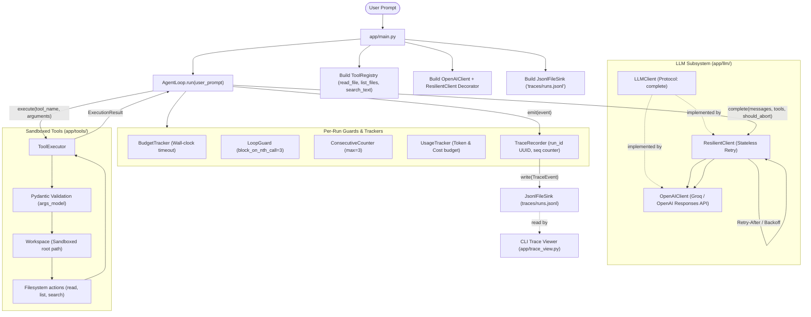
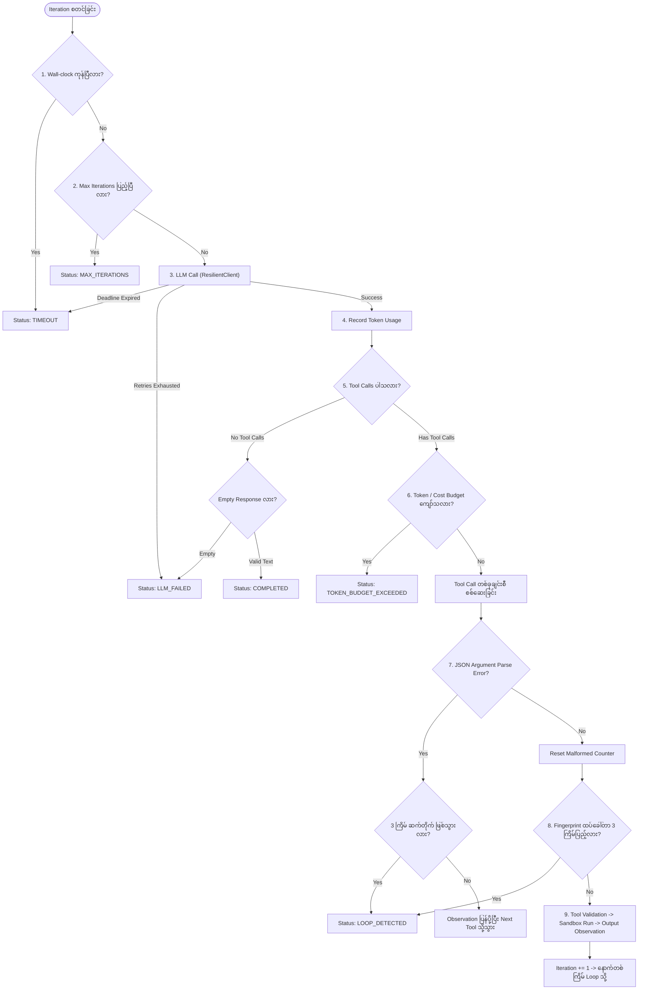

# Agent Runtime — Architecture & Workflow

ဤစာတမ်းသည် **Agent Runtime** ၏ High-Level System Architecture, Dependency Layering Rules, Runtime Guard Pipeline နှင့် Observability Workflow တို့ကို စနစ်တကျ ရေးသားထားသော စနစ်ဒီဇိုင်းလမ်းညွှန် ဖြစ်ပါသည်။

---

## မာတိကာ (Table of Contents)

1. [High-Level Architecture & Core Principles](#1-high-level-architecture--core-principles)
2. [Architectural Layering & Dependency Rules](#2-architectural-layering--dependency-rules)
3. [System Flowchart & Component Interaction](#3-system-flowchart--component-interaction)
4. [Runtime Guard Order & Safety Pipeline](#4-runtime-guard-order--safety-pipeline)
5. [Observability & Tracing Workflow](#5-observability--tracing-workflow)
6. [Resiliency, Retry & Fail-Fast Mechanics](#6-resiliency-retry--fail-fast-mechanics)
7. [Core Design Principles & Takeaways](#7-core-design-principles--takeaways)

---

## 1. High-Level Architecture & Core Principles

Agent Runtime သည် **LangChain, LangGraph, CrewAI, LlamaIndex** ကဲ့သို့သော ပြင်ပ framework များကို လုံးဝမသုံးဘဲ Python 3.12 native standard libraries နှင့် Official OpenAI SDK ကိုသာ အသုံးပြုကာ သန့်ရှင်းကျစ်လျစ်စွာ တည်ဆောက်ထားသော autonomous software engineering agent ဖြစ်ပါသည်။

### အဓိက အခြေခံမူများ:
1. **Zero External Orchestration Frameworks**: Framework များ၏ opaque abstractions များနှင့် leaky state ကြောင့် debugging ခက်ခဲမှုကို ရှောင်ရှားပြီး Python core ဖြင့်သာ deterministic behavior ကို အာမခံသည်။
2. **Provider-Neutral Design**: Core agent loop သည် မည်သည့် LLM vendor (OpenAI, Anthropic, Gemini, Groq, Ollama) နှင့်မျှ တိုက်ရိုက် မချည်နှောင်ထားပါ။
3. **Stateless Resiliency**: Retry policies, deadline tracking နှင့် counters များသည် client level တွင် state မသိမ်းဆည်းဘဲ per-call / per-run dependency injection ဖြင့်သာ စီးဆင်းသည်။
4. **Error as Observation**: Tool validation error, file not found, permission error နှင့် malformed JSON arguments များသည် runtime ကို crash မဖြစ်စေဘဲ observation message အဖြစ် model ထံ ပြန်ပို့ပေးပြီး model က self-correct လုပ်နိုင်စေသည်။
5. **Observability is Not Business Logic**: Logging သို့မဟုတ် tracing sink ချွတ်ယွင်းမှုကြောင့် core agent run လုံးဝ မရပ်တန့်စေရ (Fail-safe non-blocking trace logging)။

---

## 2. Architectural Layering & Dependency Rules

Codebase ကို အလွှာ ၄ ခုဖြင့် သီးခြားခွဲထုတ်ထားပြီး Dependency များသည် အောက်ပါ directional flow အတိုင်းသာ တရားဝင် စီးဆင်းရပါသည်:

$$\text{app/agent} \longrightarrow \text{app/llm} \longrightarrow \text{app/tools}$$

```
┌────────────────────────────────────────────────────────┐
│  Root & Entry Layer (app/main.py, app/trace_view.py)   │
└──────────────────────────┬─────────────────────────────┘
                           │ (wires components)
                           ▼
┌────────────────────────────────────────────────────────┐
│  Agent Runtime & Control Layer (app/agent/)            │
│  - Loop, State, Clock, Budgets, Guards, Tracing        │
└──────────────────────────┬─────────────────────────────┘
                           │ (imports protocol & types)
                           ▼
┌────────────────────────────────────────────────────────┐
│  LLM Subsystem Layer (app/llm/)                        │
│  - OpenAIClient, ResilientClient, Retry, Errors        │
└──────────────────────────┬─────────────────────────────┘
                           │ (imports Tool contracts)
                           ▼
┌────────────────────────────────────────────────────────┐
│  Tools & Sandbox Execution Layer (app/tools/)          │
│  - Workspace Sandbox, Validation, File & Search Tools  │
└────────────────────────────────────────────────────────┘
```

### Static AST Verification (`tests/test_layering.py`):
ဤ layering rules များကို Python Abstract Syntax Tree (AST) စစ်ဆေးမှုဖြင့် statically enforce လုပ်ထားပါသည်:
- **Rule 1 (`app/agent`)**: `app/agent` သည် provider SDK ဖြစ်သော `openai` ကို လုံးဝ import မလုပ်ရပါ။ Provider ချိတ်ဆက်မှုအားလုံးကို `app/llm` နောက်ကွယ်တွင်သာ ဝှက်ထားရမည်။
- **Rule 2 (`app/llm`)**: `app/llm` သည် `app/agent` ကို import မလုပ်ရပါ။ circular dependency ကို တင်းကျပ်စွာ တားဆီးထားသည်။
- **Rule 3 (`app/tools`)**: `app/tools` သည် `app/agent` သို့မဟုတ် `app/llm` ကို import မလုပ်ရပါ။ Tools များသည် အောက်ဆုံး layer ဖြစ်ပြီး မည်သည့် အထက် layer ကိုမှ မမှီခိုရပါ။
- **Rule 4 (Neutral Conversation)**: Conversation history သည် neutral message dictionaries (`user_message`, `assistant_message`, `tool_result_message`) သာဖြစ်ပြီး vendor-specific schemas မပါဝင်ရပါ။

---

## 3. System Flowchart & Component Interaction



---

## 4. Runtime Guard Order & Safety Pipeline

Agent loop ၏ iteration တစ်ခုချင်းစီတွင် ဖြစ်ပွားသော စစ်ဆေးမှု အစီအစဉ်သည် **System Safety** အတွက် အလွန်အရေးကြီးပါသည်။ Codebase သည် အောက်ပါ deterministic sequential order အတိုင်း တိကျစွာ လိုက်နာဆောင်ရွက်ပါသည်:

| အဆင့် | စစ်ဆေးမှု (Guard / Action) | Trigger ဖြစ်ပါက ရပ်တန့်မည့် Status | အသေးစိတ် စည်းမျဉ်း |
|:---:|:---|:---|:---|
| **1** | **Wall-clock budget** | `TIMEOUT` | စုစုပေါင်း ကြာမြင့်ချိန်သည် `max_wall_time_seconds` ကျော်လွန်ပါက LLM မခေါ်မီ ချက်ချင်း ရပ်တန့်သည်။ |
| **2** | **Iteration budget** | `MAX_ITERATIONS` | လက်ရှိ iteration နံပါတ်သည် `max_iterations` ပြည့်သွားပါက LLM မခေါ်မီ ချက်ချင်း ရပ်တန့်သည်။ |
| **3** | **LLM call & Retries** | `LLM_FAILED` သို့မဟုတ် `TIMEOUT` | Retry layer (`ResilientClient`) မှ transient retry များ ကုန်သွားလျှင် `LLM_FAILED`၊ run deadline ကုန်သွားလျှင် `TIMEOUT` ဖြစ်သည်။ |
| **4** | **Record usage** | _N/A (State Update)_ | Response တွင် ပါလာသော token usage ကို `UsageTracker` ထဲသို့ မှတ်တမ်းတင်သည်။ |
| **5** | **Final answer check** | `COMPLETED` သို့မဟုတ် `LLM_FAILED` | Tool calls မပါရှိပါက: စာသားပါလျှင် `COMPLETED` ဖြစ်သည်။ အကယ်၍ စာသားသည် whitespace/empty ဖြစ်နေပါက `LLM_FAILED` ဖြင့် fail-fast ရပ်တန့်သည်။ |
| **6** | **Token budget check** | `TOKEN_BUDGET_EXCEEDED` | Tool execution မစတင်မီ သတ်မှတ်ထားသော token သို့မဟုတ် USD cost budget ကျော်လွန်နေပါက side effect မဖြစ်စေရန် ချက်ချင်း ရပ်တန့်သည်။ |
| **7** | **Malformed arguments check** | `LOOP_DETECTED` | Tool call arguments parse မရပါက observation ပြန်ပို့သည်။ ဆက်တိုက် ၃ ကြိမ် (`ConsecutiveCounter`) ဖြစ်ပါက `LOOP_DETECTED` ဖြင့် ရပ်တန့်သည်။ |
| **8** | **Loop repetition guard** | `LOOP_DETECTED` | တူညီသော `tool_name + arguments` fingerprint ကို တတိယအကြိမ် ထပ်ခေါ်ပါက (`block_on_nth_call=3`) tool run မလုပ်မီ `LOOP_DETECTED` ဖြင့် block လုပ်သည်။ |
| **9** | **Sandboxed tool execution** | _Observation Message_ | Workspace boundary စစ်ဆေးခြင်း၊ arguments validation ပြုလုပ်ခြင်း၊ tool run ခြင်းနှင့် output ကို observation JSON အဖြစ် conversation ထဲသို့ ထည့်သွင်းခြင်း။ |



---

## 5. Observability & Tracing Workflow

Agent Runtime တွင် Production Debugging နှင့် Post-Run Analysis အတွက် Built-in Structured Tracing စနစ် ပါဝင်ပါသည်။

### 1. `TraceEvent` Lifecycle
Run တစ်ခုအတွင်း အောက်ပါ ၅ မျိုးသော immutable trace events များကို အချိန်နှင့်တပြေးညီ မှတ်တမ်းတင်ပါသည်:
- `run_started`: Run ID, Prompt, Max Iterations စတင်ချိန်။
- `llm_call`: Iteration နံပါတ်, Latency (ms), Tokens (in/out), Attempts count, Per-attempt retry log (`attempt_log`).
- `tool_call`: Tool name, Arguments, Duration (ms), Success/Failure, Payload size (chars).
- `guard_triggered`: မည်သည့် safety guard (timeout, max_iterations, loop_guard, malformed_cap, token_budget) က အဘယ်ကြောင့် ရပ်တန့်ခဲ့သည်ဆိုသည့် detail.
- `run_finished`: Final status, Total iterations, Total tokens, USD cost, Error message (ရှိပါက).

### 2. Sinks Architecture
- **`InMemorySink`**: Tests များနှင့် memory-only စစ်ဆေးမှုများအတွက် အသုံးပြုသည်။
- **`JsonlFileSink`**: Append-only JSON Lines ဖိုင် (`traces/runs.jsonl`) အဖြစ် ရေးသားသည်။ Event တိုင်းကို ချက်ချင်း disk သို့ flush လုပ်သောကြောင့် process ungraceful crash ဖြစ်သွားသော်လည်း အရင် event များ ပျောက်ဆုံးမသွားပါ။
- **Fail-Safe Principle**: Trace sink ရေးသားမှု ကျရှုံးပါက `sys.stderr` သို့သာ error message ထုတ်ပြီး Agent ၏ business execution ကို လုံးဝ မထိခိုက်စေပါ။

### 3. CLI Trace Viewer (`app/trace_view.py`)
Terminal မှနေ၍ trace logs များကို လွယ်ကူစွာ ကြည့်ရှုနိုင်သော သီးသန့် tool ဖြစ်သည်:
```bash
# Run ID များ စာရင်းထုတ်ကြည့်ရန်
python -m app.trace_view --list

# နောက်ဆုံး run ၏ summary ကို ကြည့်ရန်
python -m app.trace_view latest

# သတ်မှတ်ထားသော Run ID (သို့မဟုတ် ရှေ့စာလုံး prefix) ဖြင့် ကြည့်ရန်
python -m app.trace_view c98a72
```

---

## 6. Resiliency, Retry & Fail-Fast Mechanics

Cloud LLM API များ (ဥပမာ OpenAI, Groq) ခေါ်ဆိုရာတွင် ကြုံတွေ့ရသော Transient Errors (HTTP 429 Rate Limit, HTTP 500, 503 Overloaded, Connection Timeout) များကို အောက်ပါအတိုင်း ဖြေရှင်းထားပါသည်:

1. **Transient vs Permanent Classification**:
   - HTTP 400 Bad Request, HTTP 401 Unauthorized, HTTP 404 Model Not Found စသည်တို့သည် Permanent Errors ဖြစ်ပြီး retry မလုပ်ဘဲ ချက်ချင်း fail-fast လုပ်သည်။
   - HTTP 429, 500, 503, Connection error များသည် Transient Errors ဖြစ်ပြီး exponential backoff ဖြင့် retry လုပ်သည်။
2. **Provider `Retry-After` Header & Message Parsing**:
   - Provider ထံမှ `Retry-After` header (HTTP-date သို့မဟုတ် integer seconds) ပါလာပါက parse လုပ်ယူသည်။
   - Header မပါသော်လည်း Groq ကဲ့သို့သော provider များ၏ error message ထဲတွင် `"Please try again in 20.085s"` ဟု ပါလာပါက regex ဖြင့် စက္ကန့်ပမာဏကို ရှာဖွေဖော်ထုတ်သည်။
3. **Delay Calculation & Override**:
   - Standard exponential backoff delay နှင့် provider retry hint နှစ်ခုအနက် ပိုကြီးသောတန်ဖိုးကို ယူသည်:
     $$\text{delay} = \max(\text{backoff\_delay}, \text{retry\_after\_seconds})$$
4. **Fail-Fast Cap (`max_retry_after_seconds = 60.0`)**:
   - Provider က 300s သို့မဟုတ် အလွန်ကြာမြင့်သော wait time တောင်းဆိုလာပါက run budget ကို ကာကွယ်ရန် မစောင့်ဆိုင်းတော့ဘဲ `LLMCallFailed` ဖြင့် ချက်ချင်း fail-fast ရပ်တန့်သည်။
5. **Deadline Awareness**:
   - Run တစ်ခုလုံး၏ wall-clock budget ကုန်ဆုံးတော့မည်ဆိုပါက retry delay စောင့်မနေဘဲ `DeadlineExceeded` ဖြင့် ချက်ချင်း ထွက်ခွာသည်။

---

## 7. Core Design Principles & Takeaways

1. **No Magic / Full Predictability**: LangChain ကဲ့သို့သော library များ၏ hidden prompt injection သို့မဟုတ် opaque tool calling wrapper များကို ရှောင်ရှားပြီး ကုဒ်ကြောင်းတိုင်းကို developer ကိုယ်တိုင် ထိန်းချုပ်ထားသည်။
2. **Strict Layering (Zero Leaks)**: LLM layer သည် Tools ကိုသာသိပြီး Agent Loop ကို မသိပါ။ Agent Loop သည် Provider SDK ကို မသိပါ။
3. **Stateless Decorators**: `ResilientClient` သည် stateless ဖြစ်ပြီး per-call `should_abort` callback ဖြင့်သာ deadline စစ်ဆေးသည်။
4. **Sandboxed Workspace Security**: File tool များအားလုံးသည် `Workspace.resolve()` ကို ဖြတ်သန်းရပြီး Path Traversal Attack (`../etc/passwd`) များကို sandbox boundary ဖြင့် 100% တားဆီးထားသည်။
5. **Fail-Closed Budgeting**: Provider က token usage မပို့ပါက `0` အဖြစ် မယူဆဘဲ `None` သတ်မှတ်ကာ `usage_unreported` အဖြစ် fail-closed ပြုလုပ်ပြီး budget security ကို အာမခံသည်။
